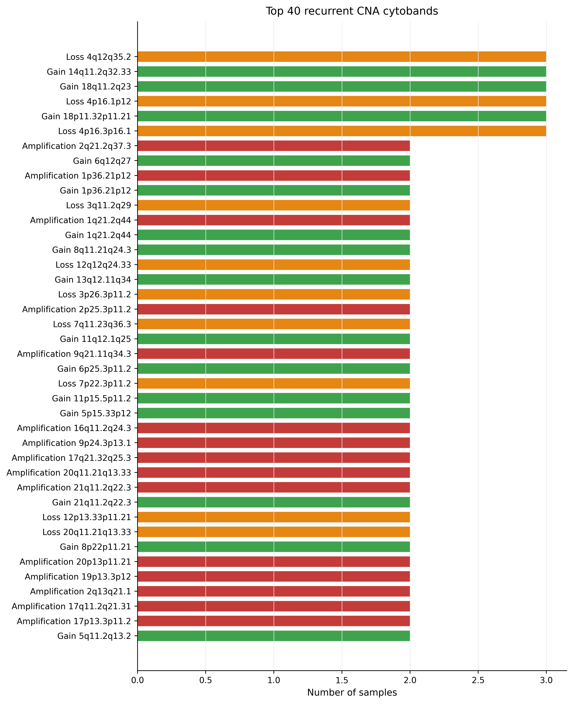

# OncoTracer: reproducible LP-WGS CNA analysis for ONT and Illumina data

[](https://oncotracer.readthedocs.io/)
[](https://hub.docker.com/r/carlosfarkas/oncotracer)
[](https://www.nextflow.io/)
[](#license)
[](https://github.com/cfarkas/oncotracer/releases)

<!-- TODO: Confirm that the ReadTheDocs project slug is really "oncotracer". If not, update all https://oncotracer.readthedocs.io/ links and badges. -->

**📖 Full documentation:** [https://oncotracer.readthedocs.io/](https://oncotracer.readthedocs.io/)

OncoTracer is a research workflow for reproducible LP-WGS copy-number alteration (CNA) analysis from ONT and Illumina data. It packages the current CNA analysis scripts into a Nextflow workflow with Docker, Singularity/Apptainer, and Conda execution paths.

```text
ONT FASTQ/barcodes or existing ONT/Illumina CNA outputs
        |                         
        v
BAM-supported CNA boundary refinement
        |
        v
CNA events -> cytogenomic notation -> cohort plots
        |
        v
optional classifier -> reports -> pathology concordance
```

OncoTracer is intended for research use. It is not a standalone diagnostic system.

## Documentation

**📖 Full documentation:** [https://oncotracer.readthedocs.io/](https://oncotracer.readthedocs.io/)

The documentation includes installation notes, YAML configuration, input requirements, running examples, output descriptions, and a worked ONT/Illumina tutorial.

Local MkDocs preview:

```bash
pip install -r docs/requirements.txt
mkdocs serve
```

Build the static site:

```bash
mkdocs build
```

## Introduction

OncoTracer turns a multi-step LP-WGS CNA analysis into a versioned, repeatable workflow. You edit one YAML file, choose an execution profile, and Nextflow runs the same stages with the same output structure each time.

It supports:

- Illumina LP-WGS runs starting from existing SAMURAI/qDNAseq outputs and aligned BAM files.
- ONT LP-WGS runs starting from existing SAMURAI/ichorCNA outputs and BAM files.
- ONT FASTQ/barcode runs that include the upstream ONT SAMURAI step.
- Optional CNA classifier, report generation, and pathology concordance summaries.

## Why OncoTracer?

- **Reproducible:** workflow logic, scripts, environments, and example YAML files live together.
- **LP-WGS focused:** designed around copy-number alteration analysis rather than broad variant calling.
- **ONT and Illumina aware:** handles the two practical input routes used in this project.
- **Command-first:** most users start by editing `params/*.yml` and running `nextflow run main.nf`.
- **Useful outputs:** event tables, cytogenomic notation, plots, reports, and workflow summaries are written into numbered folders.
- **Research reporting:** optional classifier and pathology concordance outputs help organize evidence, without replacing expert review.

## Installation

### Docker, recommended

Docker Hub is the primary container source:

```bash
docker pull carlosfarkas/oncotracer:latest
docker run --rm carlosfarkas/oncotracer:latest --help
```

Run with the Nextflow Docker profile:

```bash
nextflow run main.nf -profile docker \
  -params-file params/illumina.example.yml \
  --docker_run_options "-u $(id -u):$(id -g) -e HOME=/tmp -e MPLCONFIGDIR=/tmp/matplotlib -e XDG_CACHE_HOME=/tmp/cache -v /your/data:/your/data" \
  -resume
```

Replace `/your/data:/your/data` with the host folder that contains the files referenced in your YAML.

### Singularity / Apptainer, for HPC

```bash
apptainer pull oncotracer_latest.sif docker://carlosfarkas/oncotracer:latest
nextflow run main.nf -profile singularity \
  -params-file params/illumina.example.yml \
  --singularity_run_options '--bind /your/data:/your/data' \
  -resume
```

### Conda, fallback

Use Conda when containers are unavailable:

```bash
conda env create -f environment.yml
conda activate oncotracer
nextflow run main.nf -profile conda \
  -params-file params/illumina.example.yml \
  -resume
```

## Test

Check the container:

```bash
docker run --rm carlosfarkas/oncotracer:latest --help
```

Check Nextflow:

```bash
nextflow -version
nextflow config -profile docker
```

Check the documentation build:

```bash
pip install -r docs/requirements.txt
mkdocs build
```

## Running OncoTracer

Copy an example YAML, edit the paths, then run the matching command.

### Beginner: Illumina example YAML

Use this when you already have Illumina SAMURAI/qDNAseq CNA outputs and BAM files.

```bash
cp params/illumina.example.yml params/my_illumina.yml
nano params/my_illumina.yml
nextflow run main.nf -profile docker \
  -params-file params/my_illumina.yml \
  --docker_run_options "-u $(id -u):$(id -g) -e HOME=/tmp -e MPLCONFIGDIR=/tmp/matplotlib -e XDG_CACHE_HOME=/tmp/cache -v /your/data:/your/data" \
  -resume
```

### Moderate: ONT from existing SAMURAI/ichorCNA outputs

```bash
cp params/ont.from_existing_samurai.example.yml params/my_ont_existing.yml
nano params/my_ont_existing.yml
nextflow run main.nf -profile docker \
  -params-file params/my_ont_existing.yml \
  --docker_run_options "-u $(id -u):$(id -g) -e HOME=/tmp -e MPLCONFIGDIR=/tmp/matplotlib -e XDG_CACHE_HOME=/tmp/cache -v /your/data:/your/data" \
  -resume
```

### Specialist: ONT FASTQ/barcodes

```bash
cp params/ont.example.yml params/my_ont_fastq.yml
nano params/my_ont_fastq.yml
nextflow run main.nf -profile docker \
  -params-file params/my_ont_fastq.yml \
  --docker_run_options "-u $(id -u):$(id -g) -e HOME=/tmp -e MPLCONFIGDIR=/tmp/matplotlib -e XDG_CACHE_HOME=/tmp/cache -v /your/data:/your/data" \
  -resume
```

### Expert: classifier and pathology concordance

```bash
nextflow run main.nf -profile docker \
  -params-file params/my_illumina.yml \
  --run_cna_classifier true \
  --pathology_csv /your/data/pathology.csv \
  --pathology_sample_col illumina_sample_id \
  --pathology_case_col case_code \
  --pathology_diagnosis_col final_diagnosis \
  --docker_run_options "-u $(id -u):$(id -g) -e HOME=/tmp -e MPLCONFIGDIR=/tmp/matplotlib -e XDG_CACHE_HOME=/tmp/cache -v /your/data:/your/data" \
  -resume
```

## Outputs

Each run writes numbered folders under `outdir`:

```text
01_samurai_ont/          # ONT-only when starting from FASTQ/barcodes
02_bam_refinement/
03_cna_codification/
04_cna_custom_plots/
05_cna_classifier/       # optional
06_workflow_summary/
```

Important files:

- `03_cna_codification/cna_events.tsv`
- `03_cna_codification/cna_cytogenomic_notation.tsv`
- `04_cna_custom_plots/cna_per_sample_pages.pdf`
- `04_cna_custom_plots/cna_log2_ratio_profiles_all_samples.pdf`
- `05_cna_classifier/03_report/pdf_reports/all_sample_CNA_knowledge_reports.pdf`
- `05_cna_classifier/03_report/clinician_reports/all_sample_clinician_driver_summaries.pdf`
- `05_cna_classifier/07_pathology/pathology_concordance.tsv`
- `06_workflow_summary/workflow_summary.txt`

## Tutorial

Start with the worked tutorial: [docs/tutorial_our_runs.md](docs/tutorial_our_runs.md)

It shows the ONT and Illumina validation runs used while packaging OncoTracer, including commands, observed output counts, and example figures.

## Example outputs

| Illumina genome overview | ONT genome overview |
|---|---|
|  |  |

| Illumina event counts | ONT recurrent cytobands |
|---|---|
|  |  |

## Citation

A formal citation and DOI are coming soon. For now, please cite the GitHub repository:

```text
Farkas C. OncoTracer: reproducible LP-WGS CNA analysis for ONT and Illumina data.
https://github.com/cfarkas/oncotracer
```

See [CITATION.cff](CITATION.cff) for the current placeholder citation metadata.

## Limitations

OncoTracer is a research workflow. It is not a standalone clinical diagnostic system and does not replace pathology review, clinical interpretation, tumor purity assessment, sequencing quality review, or orthogonal molecular testing.

Optional literature, transformer, and pathology concordance layers are evidence-organization tools. They should be reviewed as research outputs, not as autonomous clinical decisions.

## License

TODO: no license file is currently present in this repository. Add a `LICENSE` file before broad redistribution, and update this section plus the badge above once the license is chosen.
