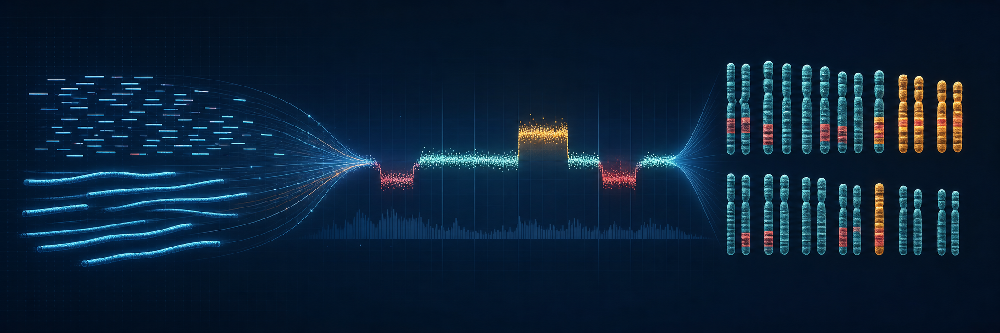

# OncoTracer



[](https://cfarkas.github.io/oncotracer/)
[](https://hub.docker.com/r/carlosfarkas/oncotracer)
[](https://www.nextflow.io/)

OncoTracer is a Nextflow research workflow for **low-pass whole-genome sequencing (LP-WGS)**. It accepts Illumina paired-end or Oxford Nanopore Technologies (ONT) FASTQ files and reports **copy-number alterations (CNAs)**: genomic regions with gains or losses of DNA.

```text
FASTQ -> SAMURAI qDNAseq/ichorCNA -> boundary refinement -> CNA tables -> plots and reports
```

Read the [beginner documentation](https://cfarkas.github.io/oncotracer/) for explanations of every file and command.

## Before you start

Use Linux and install these host prerequisites:

- [Git](https://git-scm.com/book/en/v2/Getting-Started-Installing-Git)
- [Java 17 or newer](https://www.nextflow.io/docs/latest/install.html#requirements)
- [Nextflow](https://www.nextflow.io/docs/latest/install.html)
- [Docker Engine](https://docs.docker.com/engine/install/) or, on HPC, [Apptainer](https://apptainer.org/docs/admin/main/installation.html)

The first real analysis downloads the hg38 reference (about **3.16 GB**) and BWA may take **30–60 minutes** to index it. This is a one-time preparation; later runs reuse the reference. Docker images and working files require additional disk space.

## Quick verification: one Illumina and one ONT sample

This is the smallest end-to-end check. It downloads about **225 MB of public reads**, runs both branches, and verifies their expected outputs:

```bash
git clone https://github.com/cfarkas/oncotracer.git  # download OncoTracer
cd oncotracer                                        # enter the repository; run main.nf from here
bash run_test.sh --docker                            # prepare data and run the Illumina and ONT checks
```

The script can place a Nextflow launcher in `.tools/` when Nextflow is missing, but Java, Git, and Docker must already work on the host. A successful run ends with `SUCCESS`. See the [Quick Start](https://cfarkas.github.io/oncotracer/quick_start/) for each command, generated YAML, expected runtime behavior, and output paths.

## Real three-sample public example: six FASTQs

The optional HCC1143 example downloads **1.08 GiB**: three paired LP-WGS samples, or six FASTQ files. It validates every file against ENA metadata, generates the samplesheet and YAML, runs the workflow, and checks the results:

```bash
bash examples/hcc1143_lpwgs/run_example.sh --docker # run three HCC1143 samples from download to verified outputs
```

Allow at least 40 GiB of working space. Read the [example notes](examples/hcc1143_lpwgs/README.md), [public-cohort tutorial](https://cfarkas.github.io/oncotracer/public_cohort/), and [result gallery](https://cfarkas.github.io/oncotracer/gallery/) before starting.

## Run your own FASTQs

For the simplest setup, point `--auto_params` at a reads folder and a small tumor/normal table. OncoTracer detects Illumina pairs or ONT barcode folders and creates the YAML and Illumina samplesheet:

- [Automatic setup from your FASTQ folder](https://cfarkas.github.io/oncotracer/auto_params/)
- [Manual YAML and path guide](https://cfarkas.github.io/oncotracer/configuration/yaml_basics/)
- [Input-file formats](https://cfarkas.github.io/oncotracer/inputs/)

`-stub-run` checks workflow wiring with placeholder tasks; it is **not** a complete validation of real FASTQ content or analysis behavior. The real command uses `-resume`, which lets Nextflow reuse unchanged tasks from an earlier or interrupted run.

## Main outputs

- `06_workflow_summary/workflow_summary.txt`: start here after a run
- `03_cna_codification/cna_events.tsv`: CNA event table
- `03_cna_codification/cna_cytogenomic_notation.tsv`: cytogenomic notation
- `04_cna_custom_plots/cna_per_sample_pages.pdf`: per-sample plots
- `04_cna_custom_plots/cna_log2_ratio_profiles_all_samples.pdf`: cohort plot

## Research-use limitation

OncoTracer is not a standalone diagnostic system. Results require expert review, laboratory validation, and integration with pathology and orthogonal molecular evidence.
