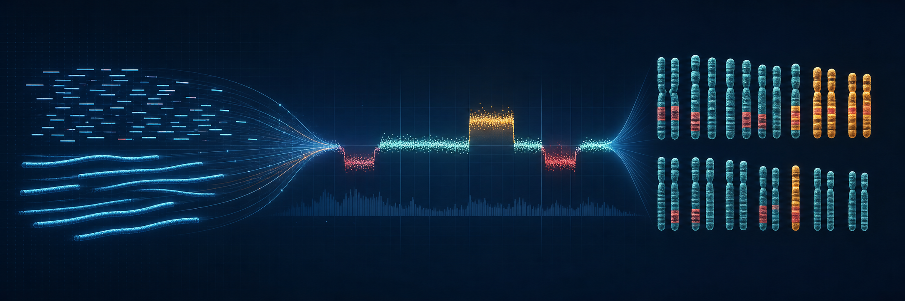

# OncoTracer



[](https://cfarkas.github.io/oncotracer/)
[](https://hub.docker.com/r/carlosfarkas/oncotracer)
[](https://www.nextflow.io/)

OncoTracer is a Nextflow research workflow for **low-pass whole-genome sequencing (LP-WGS)**. It accepts Illumina single-end or paired-end FASTQ files and Oxford Nanopore Technologies (ONT) FASTQ files, then produces copy-number alteration tables, plots, and reports.

```text
FASTQ -> SAMURAI qDNAseq/ichorCNA -> boundary refinement -> CNA tables -> plots and reports
```

Run OncoTracer through Nextflow with either `--docker` or `--singularity`. The Docker option uses [`carlosfarkas/oncotracer:latest`](https://hub.docker.com/r/carlosfarkas/oncotracer); Singularity/Apptainer can use the same image on a configured HPC system.

Read the [complete documentation](https://cfarkas.github.io/oncotracer/) for installation, tutorials, input formats, configuration, outputs, and troubleshooting.

## General usage

Keep the repository, FASTQs, configuration, work directory, and results under paths that are available to the selected container runtime.

```bash
# Choose generic locations for the repository and analysis project.
REPO_DIR=/path/to/my/directory/oncotracer
PROJECT_DIR=/path/to/my/directory/my_oncotracer_project

# Clone OncoTracer and enter the repository.
git clone https://github.com/cfarkas/oncotracer.git "$REPO_DIR"
cd "$REPO_DIR"

# Generate an Illumina YAML and samplesheet from the FASTQ folder and sample table.
nextflow run "$REPO_DIR/main.nf" --auto_params \
  --mode illumina \
  --reads_folder "$PROJECT_DIR/input/fastq" \
  --sample_table "$PROJECT_DIR/input/samples.csv" \
  --auto_config_dir "$PROJECT_DIR/config" \
  --auto_outdir "$PROJECT_DIR/results"

# Run the generated configuration with Docker and retain resumable work files.
nextflow run "$REPO_DIR/main.nf" --docker \
  -params-file "$PROJECT_DIR/config/illumina.auto.yml" \
  -work-dir "$PROJECT_DIR/work" \
  -resume

# Read the workflow summary after the analysis finishes.
cat "$PROJECT_DIR/results/06_workflow_summary/workflow_summary.txt"
```

For ONT barcode folders, use `--mode ont`. On a configured HPC system, replace `--docker` with `--singularity` in the analysis command.

## Sample table used by Automatic Setup

For Illumina, create a small CSV whose sample names match the FASTQ filenames:

```csv
sample_name,status
Sample_A,TUMOR
Sample_B,TUMOR
Control_1,NORMAL
Control_2,NORMAL
```

Automatic Setup validates the files, writes the YAML, and writes an Illumina samplesheet. It does not start the analysis. With no `NORMAL` rows, OncoTracer runs without a local panel of normals; one normal is rejected; two or more normals are used as the local qDNAseq reference.

See [Automatic Setup](https://cfarkas.github.io/oncotracer/auto_params/) for Illumina and ONT examples.

## Small public verification

QuickStart Example 1 downloads about **225 MB** of public reads and runs one Illumina and one ONT sample.

```bash
# Choose a generic clone location and test directory.
REPO_DIR=/path/to/my/directory/oncotracer
TEST_ROOT="$REPO_DIR/test"

# Clone the repository and enter it.
git clone https://github.com/cfarkas/oncotracer.git "$REPO_DIR"
cd "$REPO_DIR"

# Download and validate the public reads, then generate both YAML files.
nextflow run "$REPO_DIR/main.nf" --make_test \
  --test_root "$TEST_ROOT"

# Run the Illumina example with Docker.
nextflow run "$REPO_DIR/main.nf" --docker \
  -params-file "$TEST_ROOT/configs/illumina.quickstart.yml" \
  -work-dir "$TEST_ROOT/work/illumina" \
  -resume

# Run the ONT example after the Illumina example finishes.
nextflow run "$REPO_DIR/main.nf" --docker \
  -params-file "$TEST_ROOT/configs/ont.quickstart.yml" \
  -work-dir "$TEST_ROOT/work/ont" \
  -resume

# Verify that both workflows produced the required files.
python3 "$REPO_DIR/examples/quickstart/verify_outputs.py" \
  --test-root "$TEST_ROOT"
```

See [QuickStart Example 1](https://cfarkas.github.io/oncotracer/quick_start/) for expected files and result locations.

## Tutorials and example runs

| Goal | Guide | Data availability |
| --- | --- | --- |
| Verify one public Illumina and one public ONT sample | [QuickStart Example 1](https://cfarkas.github.io/oncotracer/quick_start/) | Downloaded by the tutorial |
| Run three paired public HCC1143 libraries | [QuickStart Example 2](https://cfarkas.github.io/oncotracer/public_cohort/) | Downloaded from ENA |
| Process all 12 public PRJNA754199 libraries | [Full Tutorial](https://cfarkas.github.io/oncotracer/full_tutorial/) | Downloaded by the tutorial |
| Configure six tumors and four normal controls | [Other Example Run](https://cfarkas.github.io/oncotracer/six_tumor_four_control/) | **Not included**; the user must provide all 20 FASTQs |

The six-tumor/four-control page is a configuration template, not a QuickStart. Its placeholder files are not uploaded to this repository, so its commands will not run until the user supplies the data.

## Main outputs

- `06_workflow_summary/workflow_summary.txt`: first file to open after a run
- `03_cna_codification/cna_events.tsv`: CNA event table
- `03_cna_codification/cna_cytogenomic_notation.tsv`: cytogenomic notation
- `04_cna_custom_plots/cna_per_sample_pages.pdf`: per-sample plots
- `04_cna_custom_plots/cna_log2_ratio_profiles_all_samples.pdf`: cohort plot
- `01_samurai_illumina/qdnaseq_local_pon/`: local-PoN files when two or more Illumina normal controls are used

## Research-use limitation

OncoTracer is not a standalone diagnostic system. Results require expert review, laboratory validation, and integration with pathology and orthogonal molecular evidence.
