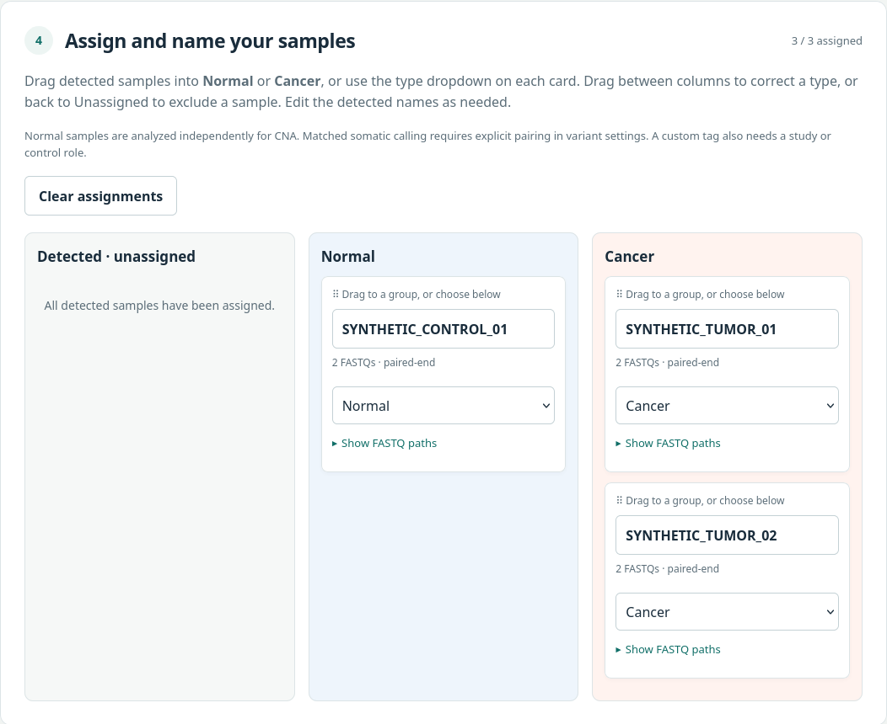

# OncoTracer

[](https://github.com/cfarkas/oncotracer/releases) [](https://cfarkas.github.io/oncotracer/) [](https://github.com/cfarkas/oncotracer/actions/workflows/native-v2-ci.yml)

Analyze Illumina and Oxford Nanopore (ONT) reads for DNA copy-number changes and optional small variants. Configure samples in your browser and follow analysis progress through to tables, plots and reports. ONT methylation supports MARLIN leukemia and Sturgeon CNS-tumor research classifiers. For research use.

**[Conda installation](#conda) · [Docker installation](#docker) · [Uninstall](#uninstall) · [Try the interactive demo](https://cfarkas.github.io/oncotracer/assets/setup-demo/index.html)**

## Install

Use Linux, Python 3.10–3.13 and Git, with **Conda or Docker** for analysis tools. First install the launcher from the current source in a directory where you keep software:

```bash
git clone --branch main https://github.com/cfarkas/oncotracer.git oncotracer-src
python3 -m venv oncotracer-env
oncotracer-env/bin/python -m pip install -e ./oncotracer-src
source oncotracer-env/bin/activate
```

Keep both folders and activate `oncotracer-env` in new terminals. Then choose **one** backend. See [requirements and installation details](docs/installation.md).

### Conda

With Conda available, install and check the managed analysis environments:

```bash
oncotracer install --conda
oncotracer doctor --backend conda
oncotracer setup --backend conda
```

Small-variant calling and FFPERASE need [additional Conda environments and resources](docs/variants.md). Installation shows progress and saves a diagnostic log.

### Docker

With Docker running and accessible to your user, install the image that supports **FASTQ → alignment → CNA and variants**:

```bash
oncotracer install --docker --image carlosfarkas/oncotracer:fastq-variants-20260922
oncotracer setup --backend docker --image carlosfarkas/oncotracer:fastq-variants-20260922 --variants
```

This route needs no host Conda. Omit `--variants` for CNA alone. Select Fresh or FFPE and compatible callers in the browser. Choose verified model preparation on Run or existing resources in the [variant guide](docs/variants.md); FFPERASE downloads require license acceptance, and ANNOVAR remains separately supplied. ONT methylation uses the Conda route.

## Uninstall

Preview removal of OncoTracer-managed Conda tools, then remove them with a recoverable backup:

```bash
oncotracer uninstall --conda --dry-run
oncotracer uninstall --conda --yes
```

For permanent removal instead, add `--purge` to the second command. Separately created variant environments need separate removal. To remove the Docker image:

```bash
docker image rm carlosfarkas/oncotracer:fastq-variants-20260922
```

To remove the launcher, run `python -m pip uninstall oncotracer` inside `oncotracer-env`. These commands preserve projects, reads and results. See [uninstall and recovery](docs/uninstall.md) for custom locations and full cleanup.

## Set up your analysis in the browser

[](https://cfarkas.github.io/oncotracer/assets/setup-demo/index.html)

**[Open the interactive demo →](https://cfarkas.github.io/oncotracer/assets/setup-demo/index.html)** — explore the real interface with synthetic samples and simulated execution. No installation required. GitHub displays the preview; the linked documentation site runs the demo.

For your own data, start the local server using the backend command above, or prefill a project:

```bash
oncotracer setup --project "$PWD/my-study" --mode illumina --input-folder /data/illumina
```

1. **Choose Illumina or ONT, then Fresh or FFPE**, before selecting input files. Assign samples to Normal or Cancer; unassigned samples are excluded. Preservation comes from specimen records, not platform.
2. **Choose settings**, including threads, reference, reports and optional variant callers. Use separate projects for Fresh and FFPE specimens.
3. **Save configuration and check**, review the configuration, then **Run analysis**. Follow progress and open results when complete.

The server opens **127.0.0.1:8888**. Keep its terminal open; if necessary, copy the complete printed URL including the session code after `#`. See the [browser walkthrough](docs/browser_demo.md) or [full setup guide](docs/setup.md).

**Terminal-only version of this example:** `oncotracer setup --terminal --project "$PWD/my-study" --mode illumina --input-folder /data/illumina --backend conda --run`. Add `--terminal --run` to the Conda/Docker examples above for terminal questions followed by execution. To run saved settings later, choose the matching backend:

```bash
oncotracer check --config "$PWD/my-study/config/run.yml"
oncotracer run --backend conda --config "$PWD/my-study/config/run.yml"
```

## Guides and examples

| Task | Guide |
| --- | --- |
| Test with public Illumina and ONT data | [QuickStart 1](docs/quick_start.md) · [QuickStart 2](docs/public_cohort.md) |
| Terminal runs or remote browser over SSH | [CLI and headless servers](docs/headless.md) |
| Prepare many libraries or barcodes | [Batch setup](docs/auto_params.md) · [Create CSV tables](docs/command_basics.md) |
| Check hardware or reuse genome indexes | [Requirements](docs/installation.md#requirements) · [Prebuilt indexes](docs/reference_indexes.md) |
| Add methylation, variants or manuscript panels | [Methylation](docs/configuration/methylation.md) · [Variants](docs/variants.md) · [ANNOVAR](docs/annovar.md) · [Paper report](docs/paper_report.md) |
| Understand results and partial failures | [Outputs](docs/outputs.md) · [Troubleshooting](docs/troubleshooting.md) |

See the [repository map](docs/repository_guide.md) for the purpose of each folder. The [complete documentation](https://cfarkas.github.io/oncotracer/) covers all settings and validation. Optional `run_cna_classifier: true` adds CNA interpretation. Runs record commands and output checksums; released builds include `release-provenance.json`.
