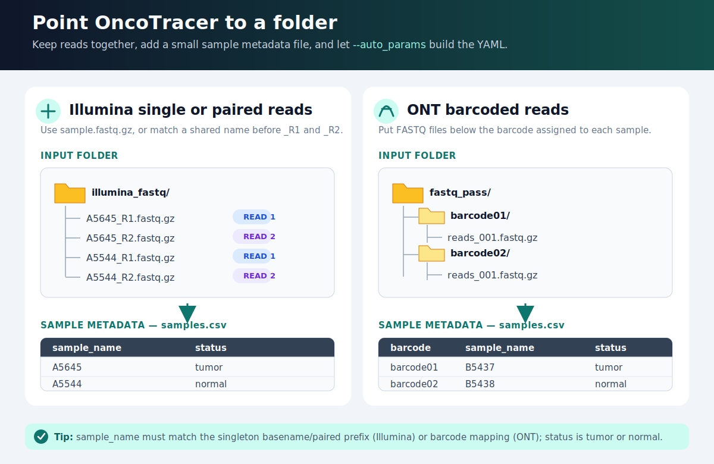

# Automatic setup from a reads folder

`--auto_params` is the shortest path from your FASTQ folder to a reproducible run. It detects the files, validates tumor/normal labels, and writes the YAML automatically. For Illumina it also writes the full paired-FASTQ samplesheet.



*Organize Illumina reads by matching R1/R2 prefixes or ONT reads by barcode, then map each sample in `samples.csv`; `--auto_params` detects the inputs and writes the run configuration.*

!!! note "Preparation only"
    `--auto_params` writes and validates configuration files. It does not start the analysis. Inspect the files, then run the two commands printed at the end.

## Illumina

Put exactly one pair per sample in one folder. Supported names include `A5645_R1.fastq.gz`/`A5645_R2.fastq.gz` and `A5645_1.fastq.gz`/`A5645_2.fastq.gz`.

Create `samples.csv`:

```csv
sample_name,status
A5645,TUMOR
A5544,NORMAL
B5437,TUMOR
```

Generate the files:

```bash
cd oncotracer
nextflow run main.nf --auto_params \
  --mode illumina \
  --reads_folder /real/path/to/illumina_fastq \
  --sample_table /real/path/to/illumina_fastq/samples.csv
```

Generated beside the reads:

```text
illumina_fastq/
├── oncotracer_config/
│   ├── illumina.auto.yml
│   └── illumina.samplesheet.csv
└── oncotracer_results/
```

Run:

```bash
nextflow run main.nf -stub-run --docker -params-file /real/path/to/illumina_fastq/oncotracer_config/illumina.auto.yml
nextflow run main.nf --docker -params-file /real/path/to/illumina_fastq/oncotracer_config/illumina.auto.yml -resume
```

## ONT

Point `--reads_folder` to `fastq_pass`, with FASTQ files inside barcode folders. The safest table includes the barcode explicitly:

```csv
barcode,sample_name,status
barcode01,A5645,TUMOR
barcode02,A5544,NORMAL
barcode03,B5437,TUMOR
```

Generate and run:

```bash
cd oncotracer
nextflow run main.nf --auto_params \
  --mode ont \
  --reads_folder /real/path/to/fastq_pass \
  --sample_table /real/path/to/fastq_pass/samples.csv
nextflow run main.nf -stub-run --docker -params-file /real/path/to/fastq_pass/oncotracer_config/ont.auto.yml
nextflow run main.nf --docker -params-file /real/path/to/fastq_pass/oncotracer_config/ont.auto.yml -resume
```

A two-column `sample_name,status` table is also accepted for ONT; rows are mapped to alphabetically sorted barcode directories. Use the explicit three-column form to avoid accidental ordering mistakes.

## Optional output locations

The defaults keep generated files and results beside the reads. Override them when needed:

```bash
nextflow run main.nf --auto_params --mode illumina \
  --reads_folder /data/run42/fastq \
  --sample_table /data/run42/samples.txt \
  --auto_config_dir /data/run42/config \
  --auto_outdir /data/run42/results
```

CSV, tab-delimited, and whitespace-delimited TXT tables are accepted. Status is case-insensitive but must be `TUMOR` or `NORMAL`. SAMURAI directories are derived automatically as `<outdir>/01_samurai_illumina` or `<outdir>/01_samurai_ont`; they do not belong in the YAML.
