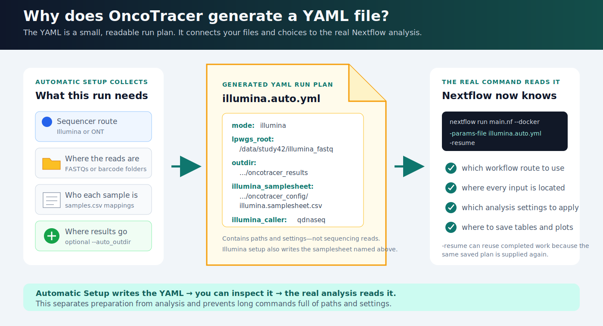
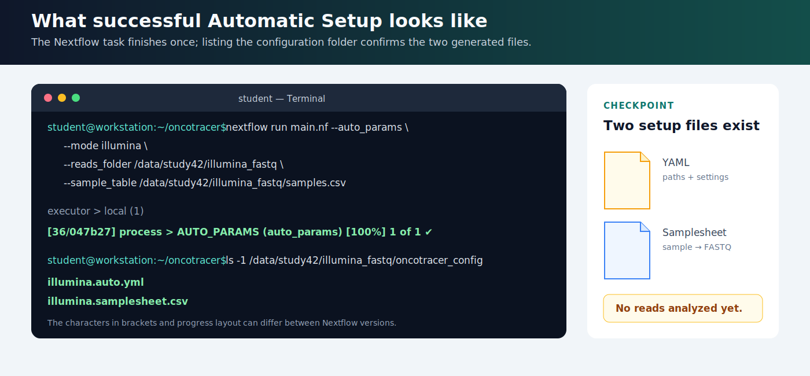

# Automatic Setup from a Reads Folder

`--auto_params` is the recommended default for configuring your own FASTQs. You provide:

1. a folder containing the reads; and
2. a small table that maps each sample to `TUMOR` or `NORMAL`.

OncoTracer checks the expected layout and writes a runnable YAML file. For Illumina, it also writes the single-end or paired-end FASTQ samplesheet.


!!! note "Configuration step, not analysis"
    `--auto_params` creates configuration files and then stops. It does not align reads or call CNAs. After it finishes, use the generated YAML in the real analysis command shown below.

## Why Automatic Setup creates a YAML

Automatic Setup first checks and matches the input files. For Illumina, it saves the FASTQ-to-sample matches in a samplesheet. It saves that samplesheet path, the results path, and the analysis settings in a readable YAML file. The real Nextflow command reads the YAML with `-params-file`, so you do not have to retype every path and option.

[](assets/tutorial/yaml_run_plan.svg)

*The YAML is a saved instruction sheet, not sequencing data and not an analysis result. Automatic Setup writes it; you can inspect it; the next command uses it to start the analysis. For Illumina, a separate generated samplesheet connects each sample to its FASTQ file or R1/R2 pair. Select a linked diagram or terminal image below to open it full size.*

## Before you begin

Install the [requirements](installation.md), clone OncoTracer, and enter the repository:

```bash
git clone https://github.com/cfarkas/oncotracer.git  # skip this line if you already have a current clone
cd oncotracer                                        # main.nf is here; run all commands from this directory
nextflow -version                                    # verify Nextflow
```

Use absolute paths. Find one with `realpath`:

```bash
realpath /path/to/my_reads # print the absolute path to the reads folder
```

Choose the section matching your sequencer.

## Illumina step by step

### 1. Organize single-end files or paired reads

For single-end data, put exactly one gzip-compressed file per sample directly inside one folder. Its basename must exactly equal the sample name:

```text
/data/study42/illumina_fastq/
├── A5645.fastq.gz
├── A5544.fastq.gz
└── B5437.fastq.gz
```

Supported exact single-end names are `<sample>.fastq.gz` and `<sample>.fq.gz`.

For paired-end data, put exactly one R1 and one R2 per sample in the folder. Keep the sample prefix identical:

```text
/data/study42/illumina_fastq/
├── A5645_R1.fastq.gz
├── A5645_R2.fastq.gz
├── A5544_R1.fastq.gz
├── A5544_R2.fastq.gz
├── B5437_R1.fastq.gz
└── B5437_R2.fastq.gz
```

Supported pair names include:

- `A5645_R1.fastq.gz` and `A5645_R2.fastq.gz`;
- `A5645_1.fastq.gz` and `A5645_2.fastq.gz`;
- the same patterns ending in `.fq.gz`.

The text before `_R1`/`_R2` or `_1`/`_2` must exactly match `sample_name` in the table. The automatic detector expects one exact singleton or one pair per sample in the top level of the reads folder; it does not recursively combine lane files. Do not mix single-end and paired-end rows in one invocation.

### 2. Create the sample table

Open a new CSV file:

```bash
nano /data/study42/illumina_fastq/samples.csv # create the sample-to-status table
```

Type these headers and one row per sample:

```csv
sample_name,status
A5645,TUMOR
A5544,NORMAL
B5437,TUMOR
```

In `nano`, save with `Ctrl+O`, press Enter to confirm the filename, and exit with `Ctrl+X`.

- `sample_name` is the exact single-end basename or paired FASTQ filename prefix.
- `status` is case-insensitive but must be `TUMOR` or `NORMAL`.
- Use short unique names containing letters, numbers, `_`, or `-`; avoid spaces.

### 3. Generate the Illumina YAML and samplesheet

Run from the cloned `oncotracer` directory:

```bash
nextflow run main.nf --auto_params \
  --mode illumina \
  --reads_folder /data/study42/illumina_fastq \
  --sample_table /data/study42/illumina_fastq/samples.csv
```

Before reporting success, the generator requires either one exact single-end file for every row or one R1/R2 pair for every row, and runs `gzip -t` on every file. It stops if an input is missing, corrupt, ambiguous, or if layouts are mixed.

When the task finishes, list the generated files:

```bash
ls -1 /data/study42/illumina_fastq/oncotracer_config
```

[](assets/tutorial/auto_params_checkpoint.svg)

*What success looks like. The two files appear in `oncotracer_config`, while the result folder remains empty of analysis outputs. The characters in brackets and the Nextflow progress layout can differ.*

By default it creates:

```text
/data/study42/illumina_fastq/
├── oncotracer_config/
│   ├── illumina.auto.yml
│   └── illumina.samplesheet.csv
└── oncotracer_results/
```

### 4. Inspect what was generated

Display both files:

```bash
sed -n '1,120p' /data/study42/illumina_fastq/oncotracer_config/illumina.auto.yml       # show the run YAML
sed -n '1,20p' /data/study42/illumina_fastq/oncotracer_config/illumina.samplesheet.csv # show detected FASTQ mappings
```

The generated YAML will look like this. This box is an annotated **YAML example**, not a terminal command:

```yaml
mode: illumina                                      # choose Illumina processing
lpwgs_root: /data/study42/illumina_fastq            # common input/output parent mounted into the container
outdir: /data/study42/illumina_fastq/oncotracer_results # final output directory
illumina_samplesheet: /data/study42/illumina_fastq/oncotracer_config/illumina.samplesheet.csv # generated FASTQ table
illumina_analysis_type: solid_biopsy                # SAMURAI analysis preset
illumina_caller: qdnaseq                            # CNA caller used for Illumina
illumina_binsize_kb: 100                            # copy-number bin size in kilobases
run_cna_classifier: false                           # optional classifier/pathology reporting is off
cna_classifier_sample_set: broad_cancer             # classifier context used if enabled
cna_classifier_profile: conda                       # nested classifier runtime
pathology_csv: null                                 # no pathology table supplied
pathology_use_biomed_models: true                   # default optional pathology-model setting
pathology_biomed_local_files_only: false             # default model file policy
force: false                                        # protect an existing real-project output directory
```

The generated samplesheet contains absolute paths:

```csv
sample,fastq_1,fastq_2,status
A5645,/data/study42/illumina_fastq/A5645_R1.fastq.gz,/data/study42/illumina_fastq/A5645_R2.fastq.gz,tumor
A5544,/data/study42/illumina_fastq/A5544_R1.fastq.gz,/data/study42/illumina_fastq/A5544_R2.fastq.gz,normal
B5437,/data/study42/illumina_fastq/B5437_R1.fastq.gz,/data/study42/illumina_fastq/B5437_R2.fastq.gz,tumor
```

For a single-end folder, the same generated table has an empty third field, for example:

```csv
sample,fastq_1,fastq_2,status
A5645,/data/study42/illumina_fastq/A5645.fastq.gz,,tumor
```

Classifier and pathology-model options supplied to the `--auto_params` command are written into the YAML, making the later real run self-contained. The [Full Tutorial](full_tutorial.md#4-generate-the-samplesheet-and-yaml-automatically) demonstrates this with CNA-only clinician-facing reports and no pathology table.

### 5. Run the analysis

```bash
nextflow run main.nf --docker \
  -params-file /data/study42/illumina_fastq/oncotracer_config/illumina.auto.yml \
  -resume
```

`-resume` reuses unchanged completed tasks if a run is repeated or interrupted.

## ONT step by step

### 1. Organize barcode folders

Point `--reads_folder` at the `fastq_pass` directory. Put one or more `.fastq`, `.fq`, `.fastq.gz`, or `.fq.gz` files directly inside each barcode directory:

```text
/data/study42/fastq_pass/
├── barcode01/
│   └── reads_001.fastq.gz
├── barcode02/
│   └── reads_001.fastq.gz
└── barcode03/
    └── reads_001.fastq.gz
```

### 2. Create an explicit barcode table

```bash
nano /data/study42/fastq_pass/samples.csv # create the barcode-to-sample table
```

Enter:

```csv
barcode,sample_name,status
barcode01,A5645,TUMOR
barcode02,A5544,NORMAL
barcode03,B5437,TUMOR
```

Save with `Ctrl+O`, press Enter, then exit with `Ctrl+X`.

Each barcode value must exactly match a directory name. OncoTracer requires at least one `TUMOR` row. Normal rows are written to the optional ONT normal settings. A two-column `sample_name,status` table is accepted and is mapped to alphabetically sorted barcode directories, but the explicit three-column form above is safer and easier to check.

### 3. Generate and inspect the ONT YAML

```bash
nextflow run main.nf --auto_params \
  --mode ont \
  --reads_folder /data/study42/fastq_pass \
  --sample_table /data/study42/fastq_pass/samples.csv
sed -n '1,140p' /data/study42/fastq_pass/oncotracer_config/ont.auto.yml # inspect the generated YAML
```

The generated file will look like this:

```yaml
mode: ont                                           # choose Oxford Nanopore processing
lpwgs_root: /data/study42/fastq_pass                # common input/output parent mounted into the container
outdir: /data/study42/fastq_pass/oncotracer_results # final output directory
ont_folder: /data/study42/fastq_pass                # parent directory containing barcode folders
ont_barcodes: barcode01,barcode03                   # tumor barcode folders, in sample order
ont_sample_names: A5645,B5437                       # tumor sample names, in the same order
ont_analysis_type: liquid_biopsy                    # SAMURAI analysis preset
ont_caller: ichorcna                                # CNA caller used for ONT
ont_binsize_kb: 500                                 # copy-number bin size in kilobases
ont_min_age_minutes: 0                              # accept completed FASTQs immediately
run_cna_classifier: false                           # optional classifier/pathology reporting is off
cna_classifier_sample_set: broad_cancer             # classifier context used if enabled
cna_classifier_profile: conda                       # nested classifier runtime
pathology_csv: null                                 # no pathology table supplied
pathology_use_biomed_models: true                   # default optional pathology-model setting
pathology_biomed_local_files_only: false             # default model file policy
force: false                                        # protect an existing real-project output directory
ont_normal_folder: /data/study42/fastq_pass         # parent directory for normal barcode folders
ont_normal_barcodes: barcode02                      # normal barcode folders
ont_normal_sample_names: A5544                      # matching normal sample names
```

The barcode and sample-name lists are positional: `barcode01` maps to `A5645`, and `barcode03` maps to `B5437`.

### 4. Run the analysis

```bash
nextflow run main.nf --docker \
  -params-file /data/study42/fastq_pass/oncotracer_config/ont.auto.yml \
  -resume
```

Use `--singularity` instead of `--docker` on a configured HPC system.

## Put configuration and results elsewhere

The defaults create `oncotracer_config/` and `oncotracer_results/` inside the reads folder. To choose other locations:

```bash
nextflow run main.nf --auto_params \
  --mode illumina \
  --reads_folder /data/run42/fastq \
  --sample_table /data/run42/samples.csv \
  --auto_config_dir /data/run42/config \
  --auto_outdir /data/run42/results
```

`--auto_config_dir` is where Automatic Setup saves the generated YAML and
Illumina samplesheet. `--auto_outdir` is where the later real analysis saves
BAMs, CNA tables, plots, and reports. Automatic Setup creates both folders,
writes the results path as `outdir:` in the YAML, and then stops without
analyzing reads.

OncoTracer derives `lpwgs_root` as a common parent that makes the reads, generated configuration, and outputs visible inside the container. It also derives the SAMURAI directory automatically as `<outdir>/01_samurai_illumina` or `<outdir>/01_samurai_ont`; do not add a SAMURAI output directory to the YAML.

CSV, tab-delimited, and whitespace-delimited TXT sample tables are accepted. CSV is recommended because its columns are easiest to see and check.

## See automatic setup with real public data

The [QuickStart Example 2 HCC1143 cohort](public_cohort.md) uses `--auto_params` on three paired Illumina samples—six FASTQ files. The [Full Tutorial](full_tutorial.md) uses it on all 12 single-end PRJNA754199 libraries and preserves the CNA-only clinician-facing reports. Runnable inputs are in [`examples/hcc1143_lpwgs`](https://github.com/cfarkas/oncotracer/tree/main/examples/hcc1143_lpwgs) and [`examples/prjna754199`](https://github.com/cfarkas/oncotracer/tree/main/examples/prjna754199).

## Second option: manual YAML editing

For the supported folder layouts above, the generated YAML is ready to run; you do not need to edit it. Use manual editing only when automatic detection does not fit the study or you need settings that are not exposed by automatic setup.

- [Manual YAML editing and path rules](configuration/yaml_basics.md) explains YAML syntax and container-visible paths.
- [Illumina manual setup](configuration/illumina.md#second-option-manual-setup) includes [How to edit a YAML file from the terminal](configuration/illumina.md#how-to-edit-a-yaml-file-from-the-terminal).
- [ONT manual setup](configuration/ont.md#second-option-manual-setup) covers custom barcode mappings and settings.
