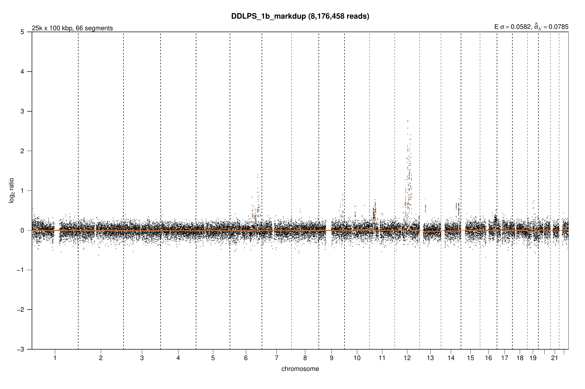
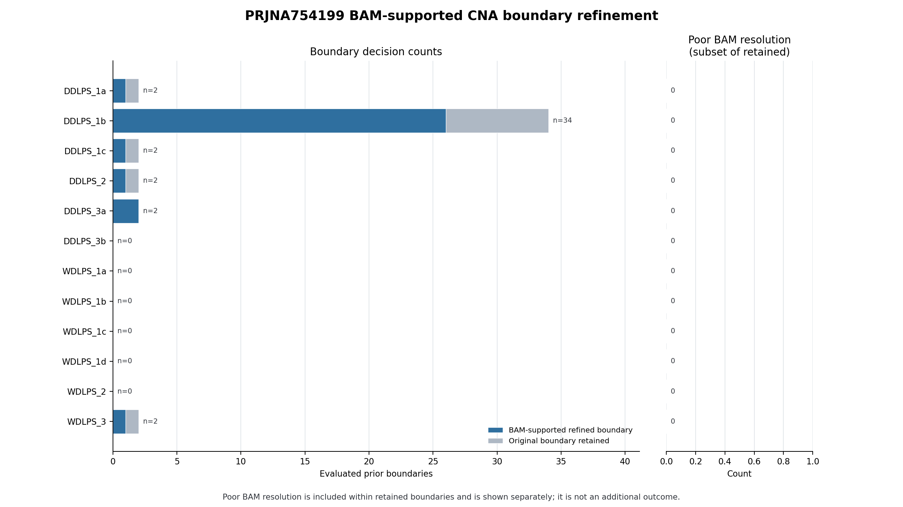
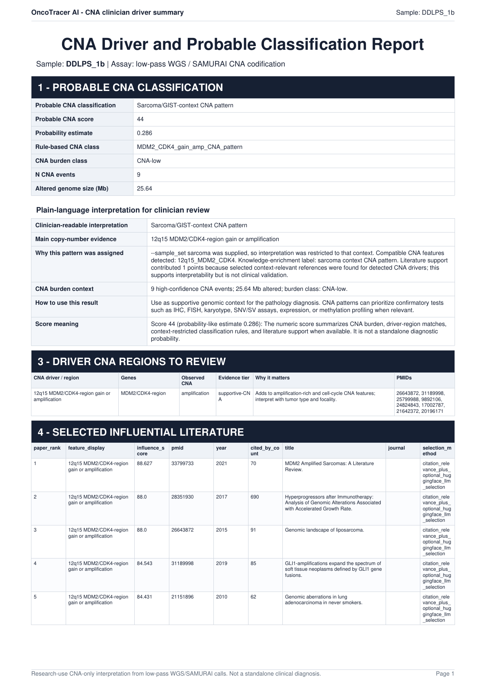

# Full tutorial: complete public PRJNA754199 archive

This tutorial processes **all 12 Illumina plasma cfDNA libraries currently exposed by the public PRJNA754199 archive**. The main path is intentionally short: download validated reads, let OncoTracer generate the samplesheet and YAML, run the workflow, verify the outputs, and review the reports.

## What this tutorial does—and does not—contain

The associated PLOS ONE article describes 41 plasma specimens from 15 patients: 10 longitudinal specimens from four DDLPS/WDLPS patients and 31 specimens from 11 patients with other soft-tissue tumors. On **15 July 2026**, the ENA read-run report returned only 12 read runs for the BioProject.

| Public archive snapshot | Value |
| --- | ---: |
| Public runs processed here | 12 |
| Layout | single-end |
| Instrument and read length | Illumina HiSeq 2500, 36 bp |
| Deposited reads | 266,097,582 |
| Deposited bases | 9,579,512,952 |
| Compressed download | 6,171,900,300 bytes (5.75 GiB) |
| Reference/caller | hg38, SAMURAI/qDNAseq, 100 kb |

Ten archive aliases correspond to the article's primary serial-sampling set. The additional aliases `WDLPS_2` and `WDLPS_3` are not reconciled to rows in the article supplement. None of the 31 other-tumor specimens is currently present in the read archive. One deposited run, `DDLPS_2`, contains 8,351,915 reads and is therefore below the article's general 10-million-read description.

!!! warning "Archive aliases are not diagnoses"
    `DDLPS_*` and `WDLPS_*` are sample names supplied with the public files. OncoTracer keeps those names but does not independently verify a diagnosis. The generated `tumor` status is a workflow label for this patient cohort, not proof of detectable ctDNA, active disease, or a CNA in any specimen.

This is an **independent reanalysis**, not an exact reproduction of the publication. The publication used GRCh37/hg19, a Plasma-Seq Z-score method, variable-mappability windows, and healthy-donor references. This tutorial uses OncoTracer's hg38 SAMURAI/qDNAseq route and has no matched tumor or healthy-donor controls.

## 1. Plan the run

Use Linux with at least **150 GiB of free working space**. Sixteen CPU cores and 64 GiB RAM are a practical starting point. The first run also prepares hg38 and its BWA index; that one-time step adds several GiB and can take 30–60 minutes before alignment begins.

Complete the [host installation requirements](installation.md#1-install-the-host-prerequisites), then clone OncoTracer. This tutorial uses `/home/student/oncotracer` as an example location. `student` is only an example Linux username; if `pwd` shows a different location, replace `/home/student/oncotracer` in the commands below with that location.

If OncoTracer is already cloned, skip the first command and enter the existing repository.

```bash
git clone https://github.com/cfarkas/oncotracer.git /home/student/oncotracer
cd /home/student/oncotracer
pwd
```

The remaining commands use `/home/student/oncotracer/test` for the reads, generated setup files, temporary work, and final results. OncoTracer creates the required subdirectories automatically.

<a id="2-prepare-software-only"></a>

## 2. Prepare the software

Prepare and check Docker without starting an analysis:

```bash
nextflow run /home/student/oncotracer/main.nf --install --docker \
  --lpwgs_root /home/student/oncotracer/test \
  -work-dir /home/student/oncotracer/test/work/install
```

This command pulls and checks the software, records the selected runtime and SAMURAI version, and then stops. It does not download hg38 or patient reads and does not create analysis stages `01`–`06`. See [Installation](installation.md#4-prepare-one-runtime-without-starting-an-analysis) for Singularity and Conda alternatives.

## 3. Download and validate the complete public archive

Download all 12 FASTQs with one resumable command:

```bash
bash /home/student/oncotracer/examples/prjna754199/run_example.sh --download-only
```

This command creates `/home/student/oncotracer/test/public/prjna754199`, downloads the 12 FASTQ files, and checks their file sizes, MD5 checksums, and gzip contents. It also places `samples.csv` in the same folder. A completed file is reused if the command is run again, and an interrupted download can continue. No analysis starts yet.

For the exact URLs, checksums, archive search, and download checks, see the [example README](https://github.com/cfarkas/oncotracer/tree/main/examples/prjna754199) and [archive details](https://github.com/cfarkas/oncotracer/blob/main/examples/prjna754199/PROVENANCE.md).

<a id="4-generate-and-inspect-the-single-end-configuration"></a>

## 4. Generate the samplesheet and YAML automatically

The download command created `samples.csv`. This small file lists each sample name and marks it as `TUMOR` for the workflow. You do not need to write the larger workflow samplesheet or YAML by hand. Run Automatic Setup:

```bash
nextflow run /home/student/oncotracer/main.nf --auto_params \
  --mode illumina \
  --reads_folder /home/student/oncotracer/test/public/prjna754199 \
  --sample_table /home/student/oncotracer/test/public/prjna754199/samples.csv \
  --auto_config_dir /home/student/oncotracer/test/configs/prjna754199 \
  --auto_outdir /home/student/oncotracer/test/runs/prjna754199 \
  --run_cna_classifier true \
  --cna_classifier_sample_set sarcoma \
  --pathology_use_biomed_models false
```

This command prepares the run; it does not process the reads. OncoTracer:

1. reads the 12 names in `samples.csv`;
2. finds the matching FASTQ for each name;
3. checks that every file uses the supported single-end name and that each gzip file can be read;
4. creates the samplesheet and YAML required by the analysis command; and
5. records where the final results should be saved.

The four path options have distinct purposes:

| Option | Meaning |
| --- | --- |
| `--reads_folder` | The existing folder that contains the downloaded FASTQ files. |
| `--sample_table` | The existing `samples.csv` file that connects each sample name to its workflow status. |
| `--auto_config_dir` | The folder where OncoTracer creates `illumina.samplesheet.csv` and `illumina.auto.yml`. |
| `--auto_outdir` | The folder where the next, real analysis command will save BAMs, CNA tables, plots, and reports. Automatic Setup creates it if needed and records it in the YAML, but does not put analysis results in it yet. |

The generated files are:

```text
/home/student/oncotracer/test/configs/prjna754199/
├── illumina.auto.yml
└── illumina.samplesheet.csv
```

`illumina.samplesheet.csv` contains one row per sample and the full path to its FASTQ. Its `fastq_2` column is empty because these reads are single-end. `illumina.auto.yml` contains the settings and paths used by the next command. The classifier is enabled, but no pathology file is supplied, so the reports contain CNA-only research interpretation rather than a pathology comparison.

<a id="5-check-wiring-then-run-the-real-workflow"></a>

## 5. Run the analysis

Start the real 12-library analysis:

```bash
nextflow run /home/student/oncotracer/main.nf --docker \
  -params-file /home/student/oncotracer/test/configs/prjna754199/illumina.auto.yml \
  -work-dir /home/student/oncotracer/test/work/prjna754199 \
  -resume
```

Keep the terminal open while this command runs. It performs alignment, CNA analysis, boundary refinement, plotting, and report generation. The first run also prepares the hg38 reference, so it can take several hours. `-resume` lets the same command continue from completed steps after an interruption.

## 6. Verify the completed run

Run the versioned verifier against the final output directory:

```bash
python3 /home/student/oncotracer/examples/prjna754199/verify_outputs.py \
  --outdir /home/student/oncotracer/test/runs/prjna754199
```

The verifier requires the exact 12 manifest aliases—not merely 12 arbitrary rows—across the BAMs, SAMURAI segments, refinement summary, and classifier table. It also requires the CNA tables, plots, clinician-report index, and workflow summary used by this tutorial.

Start reviewing the verified run from these locations:

| Capability | Source output |
| --- | --- |
| Workflow inventory | `/home/student/oncotracer/test/runs/prjna754199/06_workflow_summary/workflow_summary.txt` |
| SAMURAI fitted CNA profiles | `/home/student/oncotracer/test/runs/prjna754199/01_samurai_illumina/qdnaseq/plots/` |
| Boundary-refinement evidence | `/home/student/oncotracer/test/runs/prjna754199/02_bam_refinement/illumina_qdnaseq_100kb/01_tables/sample_refinement_summary.csv` |
| Final CNA event table | `/home/student/oncotracer/test/runs/prjna754199/03_cna_codification/cna_events.tsv` |
| Cohort and per-sample plots | `/home/student/oncotracer/test/runs/prjna754199/04_cna_custom_plots/` |
| Classifier report | `/home/student/oncotracer/test/runs/prjna754199/05_cna_classifier/03_report/cna_classifier_report.html` |
| Per-sample research reports | `/home/student/oncotracer/test/runs/prjna754199/05_cna_classifier/03_report/clinician_reports/` |

<a id="7-interpret-without-overclaiming"></a>

## 7. Review the CNA and pathology-facing reports carefully

Black qDNAseq points show normalized bin-level signal; fitted horizontal segment lines summarize the caller's piecewise CNA model. Boundary refinement asks whether local BAM coverage supports moving each coarse boundary and records refined, retained, and low-resolution outcomes.

The classifier may flag a region such as 12q13–q15 or an MDM2/CDK4 overlap for research review. A flag is not confirmation of gene amplification, disease subtype, prognosis, or treatment actionability. Review coverage, segment size, focality, longitudinal consistency, and the original event table; confirm important findings with a validated orthogonal assay.

The stage-05 HTML and per-sample PDFs are useful clinician-facing research summaries, but this archive supplies no pathology table. They must not be described as pathology-confirmed findings. To combine a future cohort with real pathology metadata, follow [Pathology and Classifier](configuration/pathology.md) and require exact sample-identifier matching.

The article reported MDM2-associated signals for selected specimens under its own method. Do not use that statement to relabel a discordant OncoTracer result or choose parameters after seeing the answer. This reanalysis has no matched tissue or healthy-donor controls and is not a sensitivity/specificity validation set.

<a id="8-preserve-provenance"></a>

## 8. Keep the files that describe the run

Keep these files with any result you share:

- `/home/student/oncotracer/examples/prjna754199/manifest.tsv`, which lists the downloaded public files and their checksums;
- `/home/student/oncotracer/examples/prjna754199/samples.csv`, which lists the sample names and workflow status;
- `/home/student/oncotracer/test/configs/prjna754199/illumina.samplesheet.csv` and `illumina.auto.yml`, which record the inputs and settings;
- `/home/student/oncotracer/test/runs/prjna754199/06_workflow_summary/workflow_summary.txt`;
- the CNA tables, plots, classifier report, and per-sample PDFs used in the interpretation.

<a id="optional-automated-replay"></a>

The [archive and checksum notes](https://github.com/cfarkas/oncotracer/blob/main/examples/prjna754199/PROVENANCE.md) describe the public files used here. The [example README](https://github.com/cfarkas/oncotracer/tree/main/examples/prjna754199) contains extra technical details for users who need them.

## Verified result gallery

The following images are static exports from the complete 12-run workflow described above. They demonstrate software output; they do not validate a diagnosis. [See the source files and checksums used for the gallery](assets/full_tutorial/gallery_provenance.tsv).

### SAMURAI fitted copy-number profile

[Open the source qDNAseq segment PDF](assets/full_tutorial/prjna754199_samurai_ddlps1b_segment_plot.pdf).



### BAM-supported boundary-refinement statistics

[Open the source 12-sample refinement summary](assets/full_tutorial/prjna754199_refinement_summary.csv).



### CNA-only research interpretation (no pathology supplied)

[Open the source research-use classifier report](assets/full_tutorial/prjna754199_cna_interpretation.pdf).



!!! warning "Research use only"
    OncoTracer is not a standalone diagnostic system or medical device. The gallery is a reproducible software demonstration. It must not be used by itself to diagnose disease, choose treatment, establish prognosis, or report a clinical result.

## Primary sources

- [NCBI BioProject PRJNA754199](https://www.ncbi.nlm.nih.gov/bioproject/PRJNA754199)
- [ENA PRJNA754199 archive record](https://www.ebi.ac.uk/ena/browser/view/PRJNA754199)
- [Przybyl et al., PLOS ONE (2022)](https://doi.org/10.1371/journal.pone.0262272)
- [Publication supplementary table S1](https://doi.org/10.1371/journal.pone.0262272.s001)
