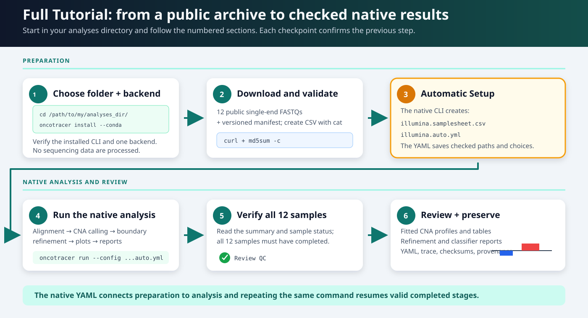
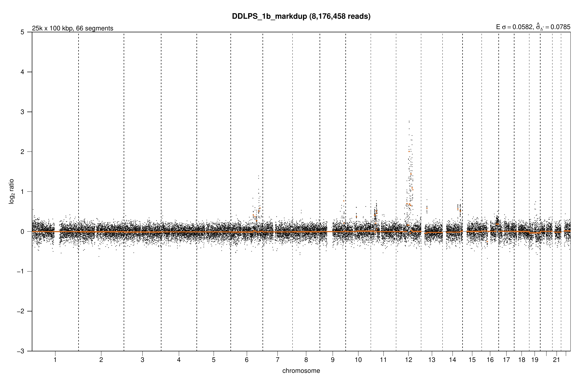
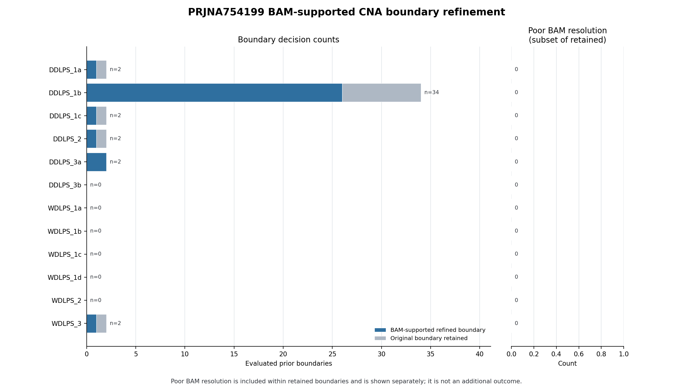
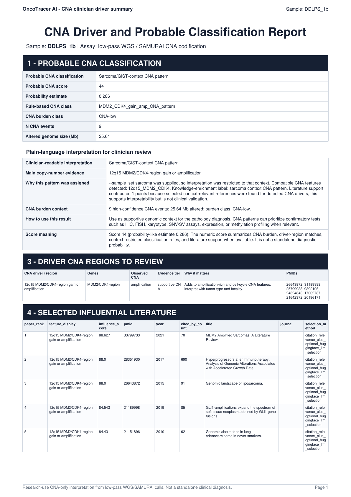

# Full tutorial: complete public PRJNA754199 archive

This tutorial processes the 12 Illumina plasma cfDNA libraries in the versioned `examples/prjna754199/manifest.tsv`. It downloads and validates the FASTQs, creates the exact sample table, generates the native YAML automatically, runs OncoTracer, verifies the main outputs, and reviews the research results.

[](assets/tutorial/full_tutorial_flow.svg)

The original article describes more specimens than the versioned public-run manifest. This tutorial intentionally analyzes the 12 archived runs represented by that manifest and records the manifest with the results.

## Dataset represented by the versioned manifest

| Property | Value |
| --- | ---: |
| Public runs | 12 |
| Layout | single-end |
| Instrument/read length | Illumina HiSeq 2500, 36 bp |
| Deposited reads | 266,097,582 |
| Deposited bases | 9,579,512,952 |
| Compressed download | about 5.75 GiB |
| Reference/caller | hg38, qDNAseq, 100 kb |

`DDLPS_*` and `WDLPS_*` are submitter-provided archive aliases. They are retained for provenance and are not independently verified diagnoses. This is a native hg38/qDNAseq reanalysis rather than an exact reproduction of the publication's original GRCh37 Plasma-Seq workflow.

## Estimated resources

Use Linux with at least:

- 150 GiB of free working space;
- 16 CPU cores when available;
- 80 GiB of addressable memory for the first BWA index;
- a stable connection for the approximately 5.75 GiB download.

The complete analysis can take several hours. The native ledger allows safe reuse of valid completed stages.

## Step 1. Install and verify one backend

Conda:

```bash
oncotracer install --conda
oncotracer doctor --backend conda
```

Docker:

```bash
oncotracer install --docker
oncotracer doctor --backend docker
```

Singularity or Apptainer:

```bash
oncotracer install --singularity
oncotracer doctor --backend singularity
```

Choose one route for the real run.

## Step 2. Download the versioned manifest and all 12 FASTQs

The following block uses only Python's standard library. It renames each archive FASTQ to the manifest sample alias so Automatic Setup can match the sample table directly. Existing files are reused only when both expected byte count and MD5 match.

```bash
TUTORIAL_ROOT="$PWD/oncotracer-prjna754199"
MANIFEST="$TUTORIAL_ROOT/manifest.tsv"
READS_DIR="$TUTORIAL_ROOT/input/fastq"

mkdir -p "$READS_DIR" \
  "$TUTORIAL_ROOT/config" \
  "$TUTORIAL_ROOT/results"

python3 - \
  "https://raw.githubusercontent.com/cfarkas/oncotracer/v2.0.0/examples/prjna754199/manifest.tsv" \
  "$MANIFEST" \
  "$READS_DIR" <<'PY'
from __future__ import annotations

import csv
import hashlib
import pathlib
import sys
import urllib.request

manifest_url = sys.argv[1]
manifest_path = pathlib.Path(sys.argv[2])
reads_dir = pathlib.Path(sys.argv[3])
reads_dir.mkdir(parents=True, exist_ok=True)

with urllib.request.urlopen(manifest_url) as response:
    manifest_bytes = response.read()
manifest_path.write_bytes(manifest_bytes)

def md5(path: pathlib.Path) -> str:
    digest = hashlib.md5()
    with path.open("rb") as handle:
        for chunk in iter(lambda: handle.read(8 * 1024 * 1024), b""):
            digest.update(chunk)
    return digest.hexdigest()

with manifest_path.open(newline="", encoding="utf-8") as handle:
    rows = list(csv.DictReader(handle, delimiter="\t"))

if len(rows) != 12:
    raise SystemExit(f"Expected 12 manifest rows, observed {len(rows)}")

for row in rows:
    destination = reads_dir / f"{row['sample_alias']}.fastq.gz"
    expected_bytes = int(row["fastq_bytes"])
    expected_md5 = row["fastq_md5"]

    valid = (
        destination.is_file()
        and destination.stat().st_size == expected_bytes
        and md5(destination) == expected_md5
    )
    if not valid:
        temporary = destination.with_suffix(destination.suffix + ".part")
        temporary.unlink(missing_ok=True)
        print(f"Downloading {row['run_accession']} -> {destination.name}", flush=True)
        urllib.request.urlretrieve(row["https_url"], temporary)
        if temporary.stat().st_size != expected_bytes:
            raise SystemExit(f"Byte-count mismatch: {destination.name}")
        if md5(temporary) != expected_md5:
            raise SystemExit(f"MD5 mismatch: {destination.name}")
        temporary.replace(destination)
    print(f"VALID {destination.name}", flush=True)

samples = reads_dir / "samples.csv"
with samples.open("w", newline="", encoding="utf-8") as handle:
    writer = csv.writer(handle)
    writer.writerow(["sample_name", "status"])
    for row in rows:
        writer.writerow([row["sample_alias"], "TUMOR"])

print(f"Wrote {samples}")
PY

gzip -t "$READS_DIR"/*.fastq.gz
cat "$READS_DIR/samples.csv"
```

Preserve `manifest.tsv` with the study record.

## Step 3. Generate the single-end YAML automatically

```bash
TUTORIAL_ROOT="$PWD/oncotracer-prjna754199"

oncotracer auto \
  --mode illumina \
  --reads-folder "$TUTORIAL_ROOT/input/fastq" \
  --sample-table "$TUTORIAL_ROOT/input/fastq/samples.csv" \
  --config-dir "$TUTORIAL_ROOT/config" \
  --outdir "$TUTORIAL_ROOT/results" \
  --run-cna-classifier
```

Add deterministic sarcoma-context settings:

```bash
CONFIG="$PWD/oncotracer-prjna754199/config/illumina.auto.yml"

cat >> "$CONFIG" <<'YAML'
cna_classifier_sample_set: sarcoma
pathology_use_biomed_models: false
run_gistic: true
gistic_required: false
knowledge_web: false
knowledge_literature_llm: false
knowledge_deep_literature: false
YAML

sed -n '1,220p' "$CONFIG"
```

Automatic Setup creates:

```text
oncotracer-prjna754199/config/
├── auto_params_manifest.tsv
├── illumina.auto.yml
└── illumina.samplesheet.csv
```

Inspect the exact 12-row samplesheet:

```bash
TUTORIAL_ROOT="$PWD/oncotracer-prjna754199"

sed -n '1,20p' "$TUTORIAL_ROOT/config/illumina.samplesheet.csv"
cat "$TUTORIAL_ROOT/config/auto_params_manifest.tsv"
```

## Step 4. Dry-run the native stage graph

```bash
TUTORIAL_ROOT="$PWD/oncotracer-prjna754199"

oncotracer run \
  --backend conda \
  --config "$TUTORIAL_ROOT/config/illumina.auto.yml" \
  --dry-run
```

The dry-run prints native argument arrays and validates the configuration without starting alignment or CNA calling.

## Step 5. Run the complete analysis

Choose exactly one backend.

### Conda

```bash
TUTORIAL_ROOT="$PWD/oncotracer-prjna754199"

oncotracer run \
  --backend conda \
  --threads 16 \
  --config "$TUTORIAL_ROOT/config/illumina.auto.yml"
```

### Docker

```bash
TUTORIAL_ROOT="$PWD/oncotracer-prjna754199"

oncotracer run \
  --backend docker \
  --threads 16 \
  --config "$TUTORIAL_ROOT/config/illumina.auto.yml"
```

### Singularity or Apptainer

```bash
TUTORIAL_ROOT="$PWD/oncotracer-prjna754199"

oncotracer run \
  --backend singularity \
  --threads 16 \
  --config "$TUTORIAL_ROOT/config/illumina.auto.yml"
```

### Poetry launcher

```bash
TUTORIAL_ROOT="$PWD/oncotracer-prjna754199"

poetry run oncotracer run \
  --backend poetry \
  --threads 16 \
  --config "$TUTORIAL_ROOT/config/illumina.auto.yml"
```

Keep the terminal open until the command returns. Repeat the same command to resume content-matched completed stages.

## Step 6. Verify the completed result tree

```bash
OUTDIR="$PWD/oncotracer-prjna754199/results"

python3 - "$OUTDIR" <<'PY'
from __future__ import annotations

import pathlib
import sys

outdir = pathlib.Path(sys.argv[1])
required = [
    outdir / "06_workflow_summary" / "workflow_summary.txt",
    outdir / "06_workflow_summary" / "workflow_summary.json",
    outdir / "06_workflow_summary" / "native_run_manifest.json",
    outdir / "03_cna_codification" / "cna_events.tsv",
    outdir / "03_cna_codification" / "cna_cytogenomic_notation.tsv",
    outdir / "04_cna_custom_plots" / "cna_per_sample_pages.pdf",
    outdir / ".oncotracer-native" / "trace.tsv",
    outdir / ".oncotracer-native" / "state.json",
]
missing = [path for path in required if not path.is_file() or path.stat().st_size == 0]
if missing:
    raise SystemExit("Missing or empty outputs:\n" + "\n".join(map(str, missing)))

summary = (outdir / "06_workflow_summary" / "workflow_summary.txt").read_text(
    encoding="utf-8"
)
for required_text in ("mode=illumina", "engine=native", "nextflow_used=false"):
    if required_text not in summary:
        raise SystemExit(f"Summary is missing {required_text!r}")

print("SUCCESS: complete PRJNA754199 native tutorial outputs are present.")
PY
```

Start review from:

| Output | Location below `results/` |
| --- | --- |
| Workflow summary | `06_workflow_summary/workflow_summary.txt` |
| qDNAseq profiles | `01_samurai_illumina/qdnaseq/plots/` |
| Refinement summary | `02_bam_refinement/illumina_qdnaseq_100kb/01_tables/sample_refinement_summary.csv` |
| Final CNA events | `03_cna_codification/cna_events.tsv` |
| Cohort/per-sample plots | `04_cna_custom_plots/` |
| Classifier HTML | `05_cna_classifier/03_report/cna_classifier_report.html` |
| Per-sample research PDFs | `05_cna_classifier/03_report/clinician_reports/` |

## Step 7. Interpret without overclaiming

Black qDNAseq points represent normalized bin-level signal; fitted horizontal lines represent coarse CNA segments. Boundary refinement evaluates whether local BAM depth supports moving each coarse boundary.

The classifier may flag recurrent regions or overlaps with genes such as `MDM2` and `CDK4`. These are research findings, not confirmed diagnoses or treatment recommendations. Review coverage, segment size, focality, longitudinal consistency, pathology, and the original CNA tables. Confirm important findings with a validated orthogonal assay.

No pathology table is supplied in this public archive example, so reports are CNA-only research summaries.

## Step 8. Preserve provenance

Keep:

- `manifest.tsv` and `input/fastq/samples.csv`;
- `config/illumina.samplesheet.csv`, `illumina.auto.yml`, and `auto_params_manifest.tsv`;
- `.oncotracer-native/trace.tsv` and `state.json`;
- `06_workflow_summary/native_run_manifest.json`;
- the release `SHA256SUMS` and `release-provenance.json`;
- all result tables, plots, and reports used in interpretation.

## Representative gallery

### qDNAseq fitted profile

[Open the source qDNAseq segment PDF](assets/full_tutorial/prjna754199_samurai_ddlps1b_segment_plot.pdf).



### Boundary-refinement statistics

[Open the source refinement summary](assets/full_tutorial/prjna754199_refinement_summary.csv).



### CNA-only interpretation

[Open the source research-use classifier report](assets/full_tutorial/prjna754199_cna_interpretation.pdf).



## Primary sources

- [NCBI BioProject PRJNA754199](https://www.ncbi.nlm.nih.gov/bioproject/PRJNA754199)
- [ENA PRJNA754199 archive record](https://www.ebi.ac.uk/ena/browser/view/PRJNA754199)
- [Przybyl et al., PLOS ONE (2022)](https://doi.org/10.1371/journal.pone.0262272)

## Research use

OncoTracer is not a standalone diagnostic system or medical device. This tutorial must not be used by itself to diagnose disease, choose treatment, establish prognosis, or report a clinical result.
