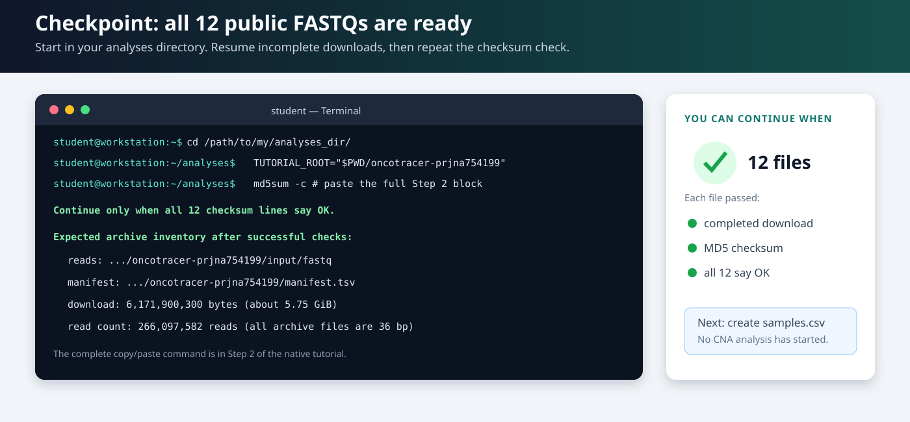
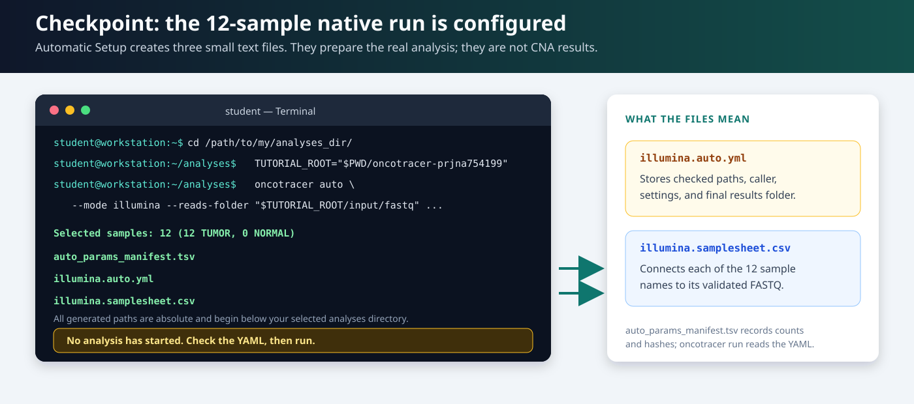
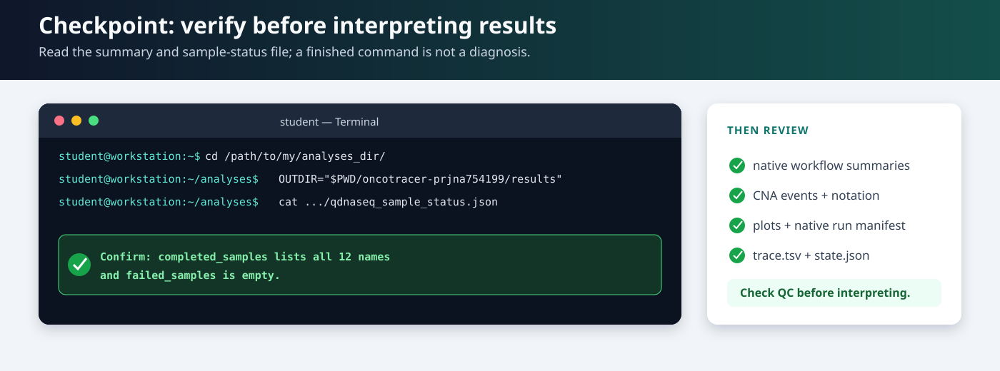

# Full tutorial: complete public PRJNA754199 archive

This tutorial processes the **12 Illumina plasma cfDNA libraries currently available in the public PRJNA754199 read archive**. It downloads validated FASTQs, generates the Illumina YAML automatically, runs OncoTracer, verifies the outputs, and reviews the result files.

Use `--docker` with [`carlosfarkas/oncotracer:latest`](https://hub.docker.com/r/carlosfarkas/oncotracer), or replace it with `--singularity` on a configured HPC system.


## Public archive used here

| Item | Value |
| --- | ---: |
| Public runs | 12 |
| Layout | single-end |
| Instrument | Illumina HiSeq 2500 |
| Read length | 36 bp |
| Deposited reads | 266,097,582 |
| Compressed download | approximately 5.75 GiB |
| Analysis route | hg38, SAMURAI/qDNAseq, 100 kb |

The associated publication describes more specimens than are currently available as public read runs. This tutorial processes the complete 12-run archive returned for the BioProject, not the full publication cohort. `DDLPS_*` and `WDLPS_*` are public archive aliases and are not independently verified diagnoses.

This is an independent hg38/qDNAseq reanalysis. It is not an exact reproduction of the publication's GRCh37 Plasma-Seq method.

## Estimated time for this analysis

Plan for at least **150 GiB** of free working space, 16 CPU cores, and **80 GiB RAM**. The first uncached run downloads hg38 and builds its BWA index. Indexing commonly takes **30–60 minutes**; processing all 12 libraries can take several hours depending on network, CPU, storage, and cache state.

## 1. Clone the repository

```bash
# Clone OncoTracer into the example directory.
git clone https://github.com/cfarkas/oncotracer.git /home/student/oncotracer

# Enter the repository.
cd /home/student/oncotracer

# Confirm the absolute path.
pwd
```

Skip the clone command when the repository already exists.

## 2. Prepare the runtime

Choose Docker or Singularity.

```bash
# Prepare and test Docker for this tutorial.
nextflow run /home/student/oncotracer/main.nf --install --docker \
  --lpwgs_root /home/student/oncotracer/test \
  -work-dir /home/student/oncotracer/test/work/install
```

```bash
# Prepare and test Singularity or Apptainer on HPC.
nextflow run /home/student/oncotracer/main.nf --install --singularity \
  --lpwgs_root /home/student/oncotracer/test \
  -work-dir /home/student/oncotracer/test/work/install
```

## 3. Download and validate the 12 FASTQs

```bash
# Download or reuse all 12 public FASTQs and validate bytes, MD5, and gzip integrity.
nextflow run /home/student/oncotracer/main.nf --make_prjna754199 \
  --test_root /home/student/oncotracer/test \
  -work-dir /home/student/oncotracer/test/work/prjna754199_download
```

The command creates `/home/student/oncotracer/test/public/prjna754199`, places `samples.csv` beside the reads, and then stops before analysis. Repeating the same command reuses validated files and continues incomplete downloads.



The generated sample table contains:

```csv
sample_name,status
DDLPS_1a,TUMOR
DDLPS_1b,TUMOR
DDLPS_1c,TUMOR
DDLPS_2,TUMOR
DDLPS_3a,TUMOR
DDLPS_3b,TUMOR
WDLPS_1a,TUMOR
WDLPS_1b,TUMOR
WDLPS_1c,TUMOR
WDLPS_1d,TUMOR
WDLPS_2,TUMOR
WDLPS_3,TUMOR
```

```bash
# Display the generated 12-row sample table.
sed -n '1,20p' /home/student/oncotracer/test/public/prjna754199/samples.csv
```

## 4. Generate the YAML automatically

`--auto_params` validates the FASTQ names, writes the single-end Illumina samplesheet, writes the YAML and manifest, and then stops.

```bash
# Generate the 12-sample YAML, samplesheet, and manifest.
nextflow run /home/student/oncotracer/main.nf --auto_params \
  --mode illumina \
  --reads_folder /home/student/oncotracer/test/public/prjna754199 \
  --sample_table /home/student/oncotracer/test/public/prjna754199/samples.csv \
  --auto_config_dir /home/student/oncotracer/test/configs/prjna754199 \
  --auto_outdir /home/student/oncotracer/test/runs/prjna754199 \
  --run_cna_classifier true \
  --cna_classifier_sample_set sarcoma \
  --pathology_use_biomed_models false \
  -work-dir /home/student/oncotracer/test/work/prjna754199_auto_params
```

```bash
# List the generated configuration files.
ls -1 /home/student/oncotracer/test/configs/prjna754199

# Inspect the generated YAML.
sed -n '1,160p' /home/student/oncotracer/test/configs/prjna754199/illumina.auto.yml

# Inspect the generated single-end samplesheet.
sed -n '1,20p' /home/student/oncotracer/test/configs/prjna754199/illumina.samplesheet.csv

# Inspect sample counts and file hashes.
cat /home/student/oncotracer/test/configs/prjna754199/auto_params_manifest.tsv
```



## 5. Run the analysis

```bash
# Optionally check the generated workflow wiring with Docker.
nextflow run /home/student/oncotracer/main.nf -stub-run --docker \
  -params-file /home/student/oncotracer/test/configs/prjna754199/illumina.auto.yml \
  -work-dir /home/student/oncotracer/test/work/prjna754199_stub

# Run or resume the complete 12-library analysis with Docker.
nextflow run /home/student/oncotracer/main.nf --docker \
  -params-file /home/student/oncotracer/test/configs/prjna754199/illumina.auto.yml \
  -work-dir /home/student/oncotracer/test/work/prjna754199 \
  -resume
```

On HPC, replace `--docker` with `--singularity` in the stub and real analysis commands.

## 6. Verify the completed run

```bash
# Verify the expected 12 aliases and required output files.
python3 /home/student/oncotracer/examples/prjna754199/verify_outputs.py \
  --outdir /home/student/oncotracer/test/runs/prjna754199
```

A successful check prints:

```text
SUCCESS: complete PRJNA754199 tutorial outputs are verified.
```



## 7. Open the main results

```bash
# Read the workflow summary.
cat /home/student/oncotracer/test/runs/prjna754199/06_workflow_summary/workflow_summary.txt

# Inspect the final CNA event table.
sed -n '1,20p' /home/student/oncotracer/test/runs/prjna754199/03_cna_codification/cna_events.tsv

# Inspect the cytogenomic notation table.
sed -n '1,20p' /home/student/oncotracer/test/runs/prjna754199/03_cna_codification/cna_cytogenomic_notation.tsv

# List the generated cohort and per-sample plots.
find /home/student/oncotracer/test/runs/prjna754199/04_cna_custom_plots \
  -maxdepth 2 -type f -print | sort

# List the optional classifier reports.
find /home/student/oncotracer/test/runs/prjna754199/05_cna_classifier \
  -maxdepth 4 -type f -print | sort | sed -n '1,80p'
```

Start with these locations:

| Result | Path below `test/runs/prjna754199/` |
| --- | --- |
| Workflow summary | `06_workflow_summary/workflow_summary.txt` |
| SAMURAI qDNAseq profiles | `01_samurai_illumina/qdnaseq/plots/` |
| Boundary-refinement summary | `02_bam_refinement/illumina_qdnaseq_100kb/01_tables/sample_refinement_summary.csv` |
| Final CNA events | `03_cna_codification/cna_events.tsv` |
| Plots | `04_cna_custom_plots/` |
| Classifier reports | `05_cna_classifier/03_report/` |

## 8. Resume an interrupted analysis

```bash
# Return to the repository.
cd /home/student/oncotracer

# Repeat the same command with the same YAML and work directory.
nextflow run /home/student/oncotracer/main.nf --docker \
  -params-file /home/student/oncotracer/test/configs/prjna754199/illumina.auto.yml \
  -work-dir /home/student/oncotracer/test/work/prjna754199 \
  -resume
```

## Verified result gallery

### SAMURAI fitted copy-number profile

[Open the source PDF](assets/full_tutorial/prjna754199_samurai_ddlps1b_segment_plot.pdf).


### BAM-supported boundary-refinement statistics

[Open the source CSV](assets/full_tutorial/prjna754199_refinement_summary.csv).


### CNA-only research interpretation

[Open the source PDF](assets/full_tutorial/prjna754199_cna_interpretation.pdf).


The archive supplies no matched pathology table. Classifier labels and highlighted regions are research hypotheses, not pathology-confirmed findings, diagnoses, prognostic conclusions, or treatment recommendations.

## Keep the run information

Preserve the download manifest and checksums, `samples.csv`, generated YAML and samplesheet, OncoTracer commit, installation manifest, workflow summary, CNA tables, and figures used in any report.

## Primary sources

- [NCBI BioProject PRJNA754199](https://www.ncbi.nlm.nih.gov/bioproject/PRJNA754199)
- [ENA PRJNA754199 archive record](https://www.ebi.ac.uk/ena/browser/view/PRJNA754199)
- [Przybyl et al., PLOS ONE (2022)](https://doi.org/10.1371/journal.pone.0262272)

OncoTracer is for research use and is not a standalone diagnostic system.
