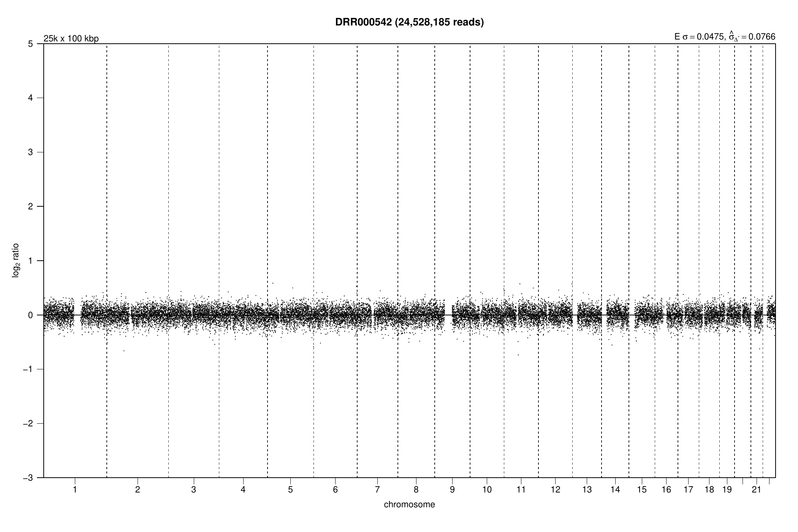
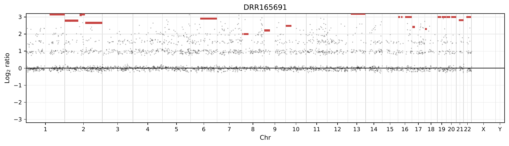
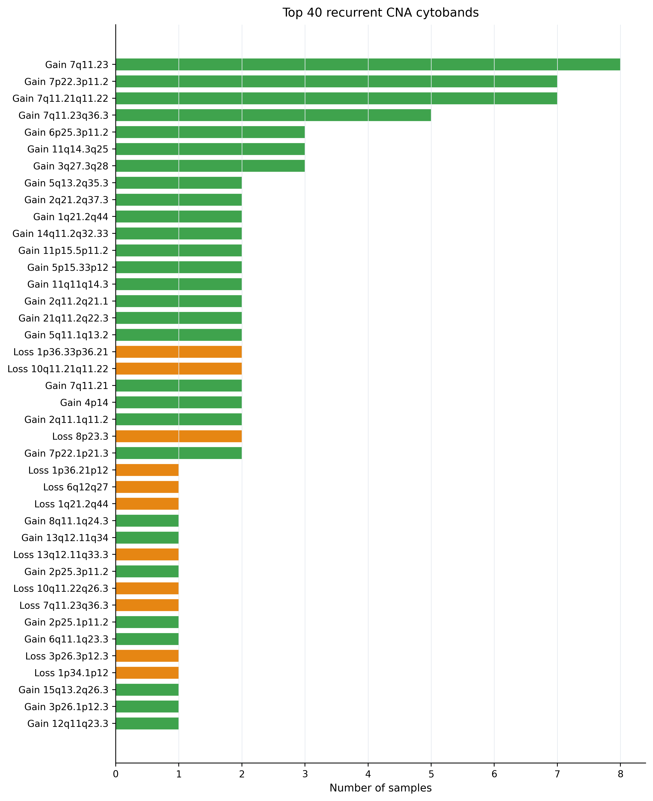
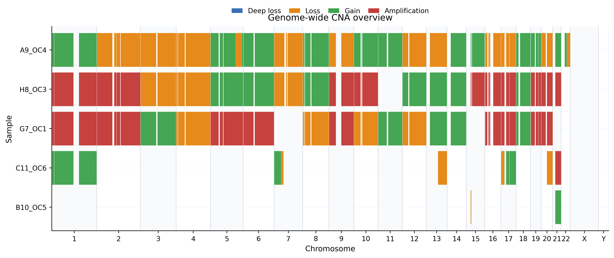

# Results gallery

The images below are rendered from OncoTracer output files. A plot demonstrates that a workflow completed and shows the CNA profile produced under that configuration; it does not validate a diagnosis.

## One-sample Illumina public test

**Provenance:** ENA run `ERR12341627`, processed by the public Illumina Quick Start with qDNAseq at 100 kb. See [Quick verification](quick_start.md) for the reproducible command and generated YAML.

[Open the original qDNAseq bin plot PDF](assets/gallery/illumina_samurai_qdnaseq_bin_plot.pdf).

**How to read it:** genomic position runs across the chromosomes; deviations in normalized bin signal support candidate copy-number change. Segmentation and final event calls should be checked in stages 02 and 03 rather than estimated from pixels.

## One-sample ONT public test

**Provenance:** public ONT run `DRR165691`, processed by the ONT Quick Start with ichorCNA-derived 500 kb inputs.

The run produces ichorCNA depth and segment tables. OncoTracer renders the profile from those tables even when an upstream plotting helper encounters missing depth values.

[Open the original ichorCNA-derived profile PDF](assets/gallery/ont_ichorcna_derived_profile.pdf).

**How to read it:** broad changes are more defensible than isolated noisy points in low-pass data. Review the used/skipped FASTQ logs, coverage, segment table, and tumor fraction before biological interpretation.

## Final OncoTracer Illumina visualizations

These are presentation views derived from `03_cna_codification/cna_events.tsv` and the refined bin table.

## Final OncoTracer ONT visualizations

## HCC1143 three-library, six-FASTQ public cohort

!!! warning "Verified gallery artifact pending"
    The reproducible downloader and run script are present, but this section intentionally does not claim a cohort result until the complete run, output checks, provenance record, and gallery export have all been verified. The maintainer will replace this notice with the actual plot and measured result summary after that run.

The example contains three paired-end LP-WGS libraries (six physical FASTQ files) from the HCC1143 triple-negative breast-cancer cell line.

| Provenance field | Value |
| --- | --- |
| Public project | [PRJNA454331](https://www.ebi.ac.uk/ena/browser/view/PRJNA454331) |
| Associated study | [Ben-David et al., Nature Communications (2018)](https://doi.org/10.1038/s41467-018-05729-w) |
| Libraries/runs | DMSO `SRR7085656`; BEZ235 `SRR7085655`; Trametinib `SRR7085657` |
| Physical FASTQs | 6: one R1/R2 pair for each of 3 libraries |
| Experimental status | All are `TUMOR`; DMSO is a treatment control, not a normal genome |
| Download validation | Exact ENA byte count, ENA MD5, and `gzip -t`; values stored in `examples/hcc1143_lpwgs/manifest.tsv` |
| Reproduction command | `bash examples/hcc1143_lpwgs/run_example.sh --docker` |
| Expected result source | `test/runs/hcc1143_lpwgs/04_cna_custom_plots/cna_log2_ratio_profiles_all_samples.pdf` |
| OncoTracer commit | _to be recorded after verified run_ |
| Container digest | _to be recorded after verified run_ |
| Reference/caller/bin size | _to be recorded after verified run_ |
| Run completion and checks | _to be recorded after verified run_ |
| Biological interpretation | _not reported before QC and verified tables are available_ |

When populated, this gallery entry must distinguish observed signal from inference: report sample names, caller/bin size, QC warnings, number of CNA events, broad profile similarities/differences, and important limitations. Treatment-associated causality must not be inferred from this three-library demonstration alone.

See the example's [provenance and resource notes](https://github.com/cfarkas/oncotracer/tree/main/examples/hcc1143_lpwgs) and [Output files](outputs.md) for the tables behind every plot.
