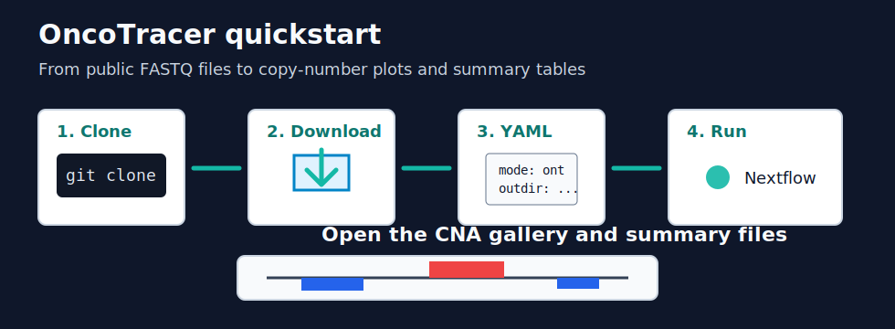

# Gallery

These images are real OncoTracer copy-number analysis plots from the public example runs and the documented tutorial runs. They are included so new users can recognize successful output before opening their own result folders.



## Illumina Copy-Number Outputs


## ONT Copy-Number Outputs


## SAMURAI Copy-Number Plots

The quickstart also writes SAMURAI caller plots inside the run folder:

```text
oncotracer/test/runs/illumina/01_samurai_illumina/cn_plots/qdnaseq/genome_plot.pdf
oncotracer/test/runs/illumina/01_samurai_illumina/qdnaseq/plots/DRR000542_bin_plot.pdf
oncotracer/test/runs/illumina/01_samurai_illumina/qdnaseq/plots/DRR000542_segment_plot.pdf
```

Open those PDFs after the Illumina quickstart to inspect the upstream qDNAseq/SAMURAI copy-number signal before OncoTracer boundary refinement and reporting.
