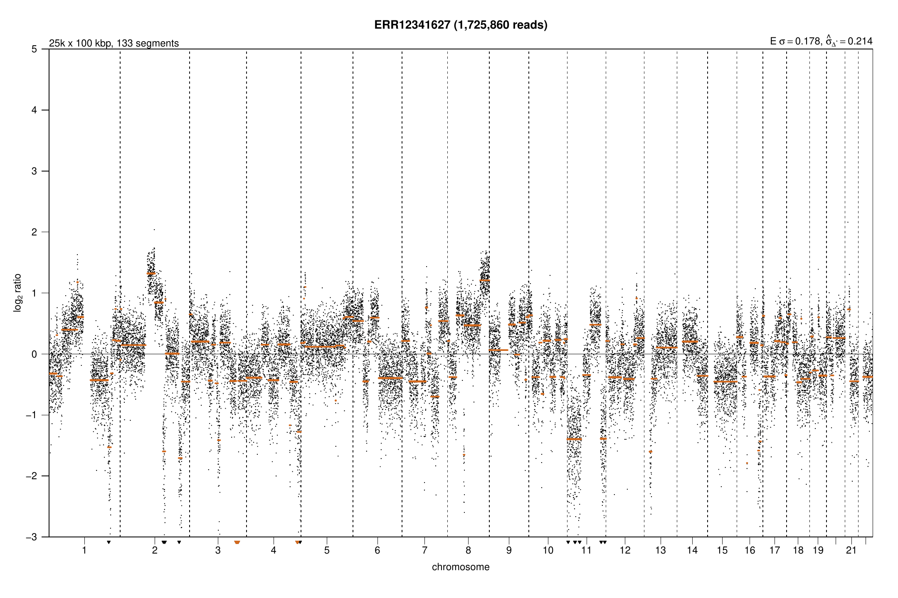
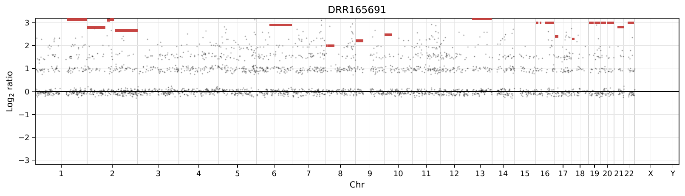
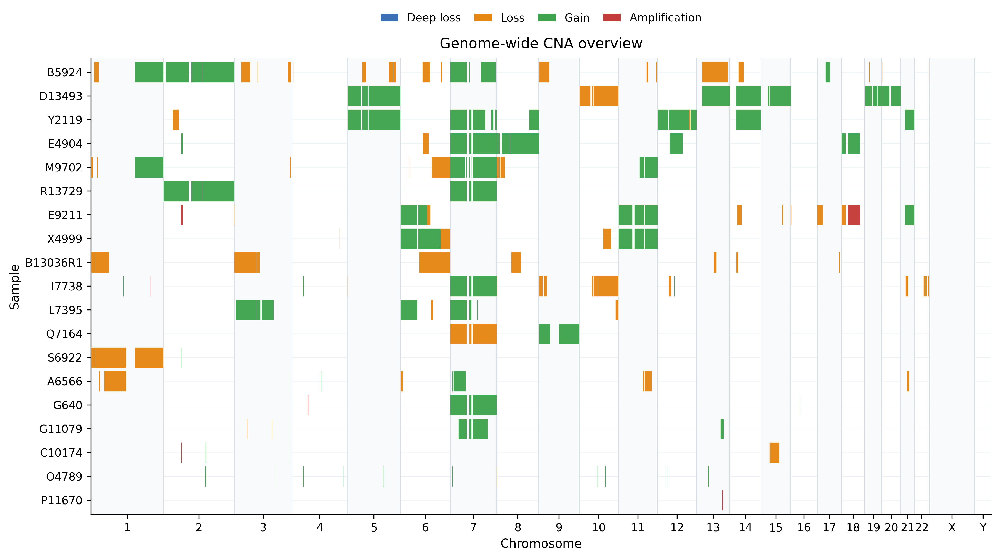
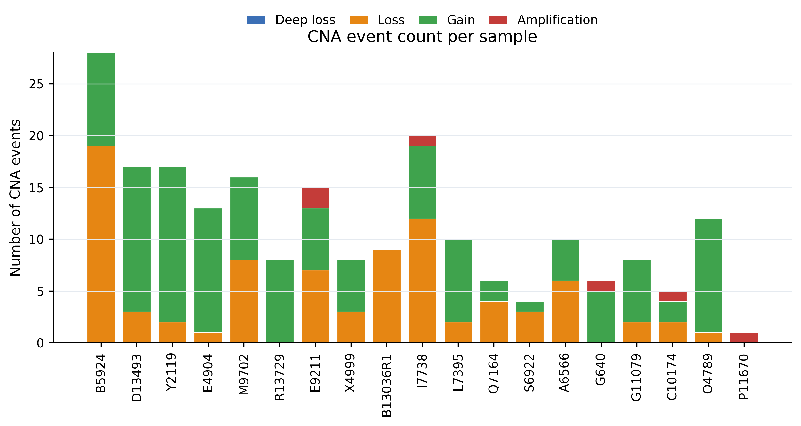
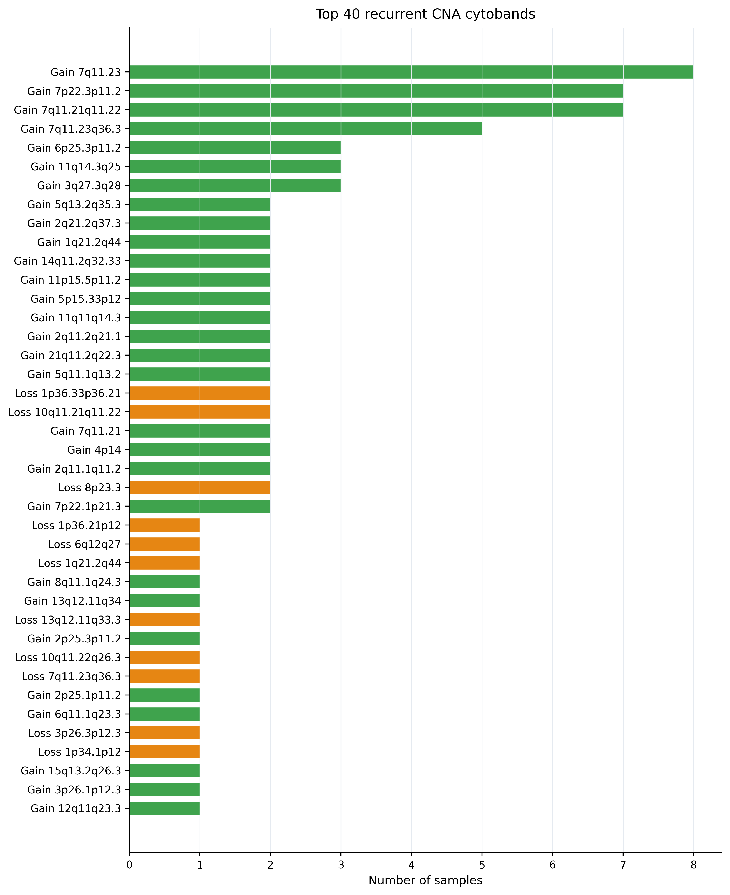
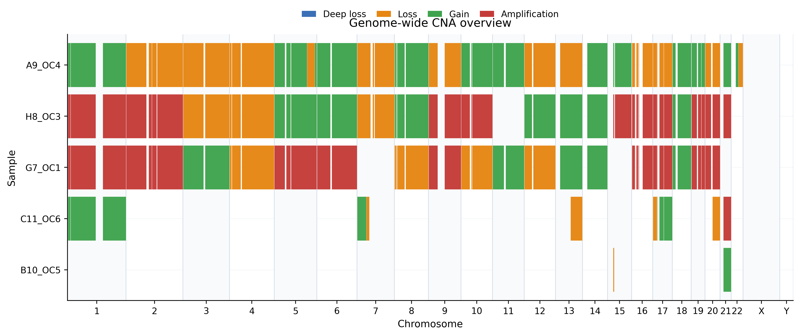
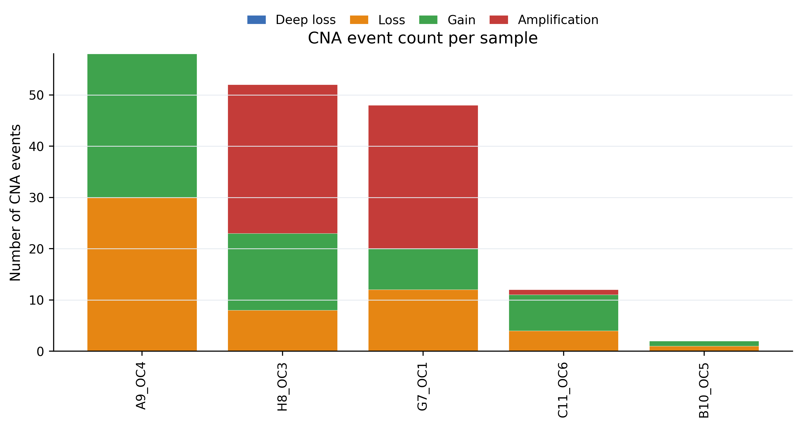
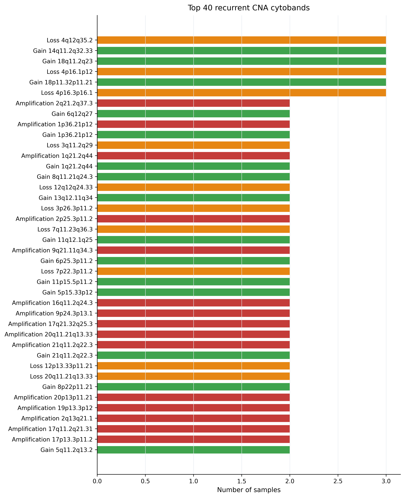

# Results Gallery

The images below are rendered from OncoTracer output files. A plot demonstrates the workflow output produced under one configuration; it does not validate a diagnosis.

## One-sample Illumina public test

**Provenance:** ENA run `ERR12341627`, processed in [QuickStart Example 1](quick_start.md) with qDNAseq at 100 kb.

[Open the source PDF](assets/gallery/illumina_samurai_qdnaseq_segment_plot.pdf).

Black points are normalized qDNAseq bins; horizontal fitted segments summarize the initial copy-number model. Final refined segments and event tables are in stages 02 and 03.

## One-sample ONT public test

**Provenance:** public ONT run `DRR165691`, processed in [QuickStart Example 1](quick_start.md) with ichorCNA-derived 500 kb inputs.

[Open the source PDF](assets/gallery/ont_ichorcna_derived_profile.pdf).

Black points are bin-level log2 ratios; horizontal segments are the fitted ichorCNA-derived means. Review coverage, segment tables, and used/skipped FASTQ logs before biological interpretation.

## Final Illumina visualizations

## Final ONT visualizations

## HCC1143 three-library public cohort

The complete download and analysis commands are documented in [QuickStart Example 2](public_cohort.md). A final cohort gallery figure is not published here until the complete run, output checks, provenance record, and figure export have been verified together.

| Provenance field | Value |
| --- | --- |
| Public project | [PRJNA454331](https://www.ebi.ac.uk/ena/browser/view/PRJNA454331) |
| Associated study | [Ben-David et al., Nature Communications (2018)](https://doi.org/10.1038/s41467-018-05729-w) |
| Libraries/runs | DMSO `SRR7085656`; BEZ235 `SRR7085655`; Trametinib `SRR7085657` |
| Physical FASTQs | Six: one R1/R2 pair for each library |
| Status | All are `TUMOR`; DMSO is not a matched normal genome |
| Validation | Exact ENA byte count, MD5, and `gzip -t` |
| Reproduction guide | [QuickStart Example 2](public_cohort.md) |
| Expected combined plot | `test/runs/hcc1143_lpwgs/04_cna_custom_plots/cna_log2_ratio_profiles_all_samples.pdf` |

Do not infer treatment causality from this three-library software example.

## Other example run

[Six tumors and four normal controls](six_tumor_four_control.md) is a configuration template only. Its placeholder FASTQs are not included in the repository, so it has no bundled result gallery.

OncoTracer is for research use and is not a standalone diagnostic system.
