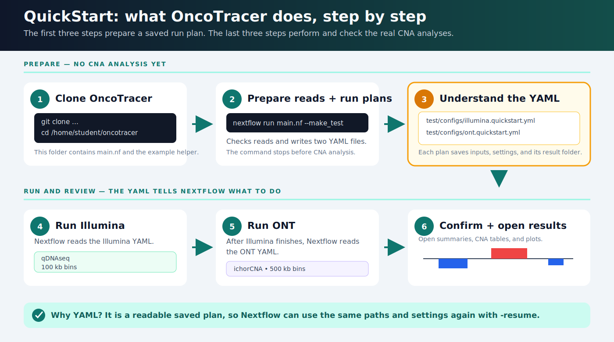
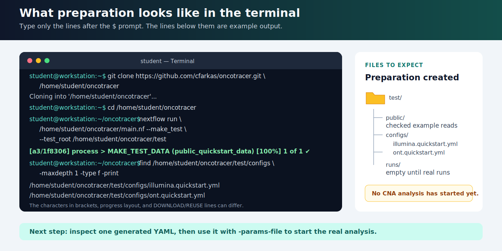
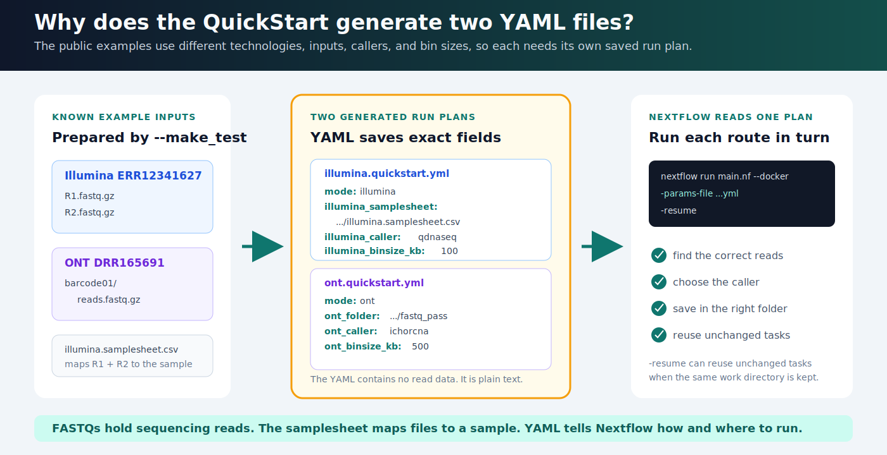
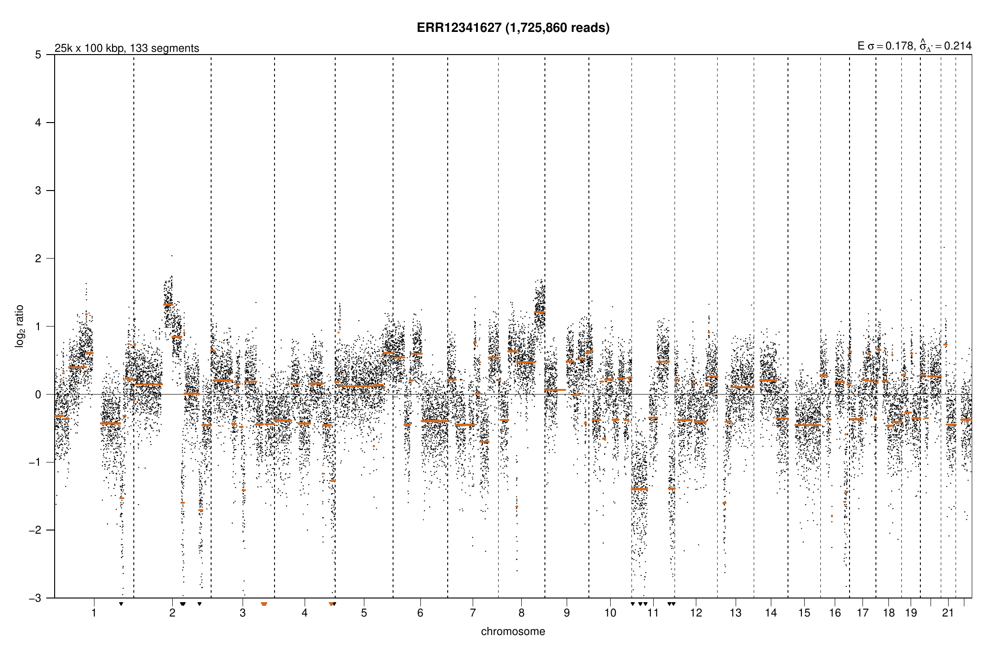
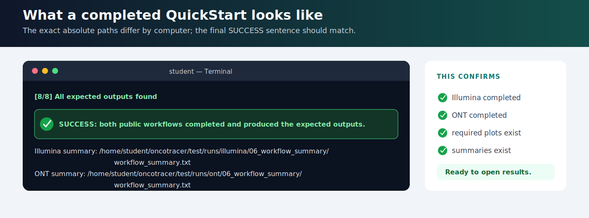

<a id="quick-start"></a>

# QuickStart Example 1: one Illumina + one ONT sample

This tutorial verifies a new OncoTracer installation with one public Illumina sample and one public Oxford Nanopore Technologies (ONT) sample. It downloads about **225 MB of compressed reads**. Follow the numbered steps to see what is prepared, why two YAML files are generated, how each analysis starts, and where the results appear.

[](assets/tutorial/quickstart_flow.svg)

*The first three steps prepare files and stop. The real CNA analyses begin only when a generated YAML is supplied with `-params-file`. Select a linked diagram or terminal image below to open it full size.*

## Before running

Complete [Installation](installation.md). This example uses Docker and the example repository location `/home/student/oncotracer`. Replace that path in the commands if your Linux username or clone location is different.

Confirm the required programs:

```bash
git --version       # Git must be installed
java -version       # Java must be version 17 or newer
nextflow -version   # Nextflow must be available
docker --version    # Docker must be installed
```

!!! warning "The first analysis is much larger than the example reads"
    On the first real run, SAMURAI downloads the hg38 reference (about **3.16 GB**) and BWA commonly takes **30–60 minutes** to create its index. This happens once; later `-resume` runs reuse it. Docker layers and workflow intermediate files require additional disk space.

## Beginner route: follow each step

### 1. Clone OncoTracer

Open a terminal and enter:

If [Installation](installation.md) already created `/home/student/oncotracer`, skip the `git clone` line and run only `cd` and `pwd`. Otherwise run all three lines:

```bash
git clone https://github.com/cfarkas/oncotracer.git /home/student/oncotracer
cd /home/student/oncotracer
pwd
```

`pwd` should print `/home/student/oncotracer`. The file `main.nf` is inside this folder.

### 2. Prepare the public reads and run plans

Run:

```bash
nextflow run /home/student/oncotracer/main.nf --make_test \
  --test_root /home/student/oncotracer/test
```

This preparation command:

1. downloads or reuses one paired Illumina example and one ONT example;
2. checks each file's expected size, MD5 checksum, and gzip contents;
3. creates the Illumina samplesheet; and
4. writes one YAML run plan for Illumina and another for ONT.

It does **not** align reads or call CNAs.

List the two YAML files:

```bash
find /home/student/oncotracer/test/configs -maxdepth 1 -type f -print
```

[](assets/tutorial/quickstart_terminal_prepare.svg)

*What preparation looks like. `DOWNLOAD` means a file was transferred; `REUSE` means an existing checked file was kept. The characters in brackets and the progress layout can differ.*

The prepared folders are:

```text
/home/student/oncotracer/test/
├── configs/
│   ├── illumina.quickstart.yml
│   └── ont.quickstart.yml
├── public/
│   ├── illumina_ERR12341627/
│   └── ont_DRR165691/
└── runs/
```

### 3. Understand why YAML is generated

A FASTQ contains sequencing reads. A samplesheet connects read files to an Illumina sample. A YAML file is different: it is a small, readable **run plan** containing paths and analysis choices.

[](assets/tutorial/quickstart_yaml_plan.svg)

*The YAML contains paths and settings, not sequencing reads or results. It prevents a very long run command and lets the same choices be supplied again with `-resume`.*

Two YAML files are needed because the examples use different routes:

| Run plan | Input mapping | Caller and bin size | Result folder |
| --- | --- | --- | --- |
| `illumina.quickstart.yml` | paired R1/R2 files through an Illumina samplesheet | qDNAseq, 100 kb | `test/runs/illumina` |
| `ont.quickstart.yml` | `barcode01` below an ONT `fastq_pass` folder | ichorCNA, 500 kb | `test/runs/ont` |

Nextflow reads the selected plan after `-params-file`:

```text
-params-file /home/student/oncotracer/test/configs/illumina.quickstart.yml
```

You do not need to edit either YAML for this QuickStart.

#### What the Illumina YAML means

Display it:

```bash
sed -n '1,120p' /home/student/oncotracer/test/configs/illumina.quickstart.yml
```

The generated file contains your real absolute paths:

```yaml
mode: illumina
lpwgs_root: /home/student/oncotracer/test
outdir: /home/student/oncotracer/test/runs/illumina
illumina_samplesheet: /home/student/oncotracer/test/public/illumina_ERR12341627/illumina.samplesheet.csv
illumina_analysis_type: solid_biopsy
illumina_caller: qdnaseq
illumina_binsize_kb: 100
run_cna_classifier: false
force: true
```

The samplesheet links `ERR12341627` to its R1 and R2 FASTQs. This public example is [ENA ERR12341627](https://www.ebi.ac.uk/ena/browser/view/ERR12341627), an OVCAR8 cancer whole-genome sequencing run.

#### What the ONT YAML means

Display it:

```bash
sed -n '1,120p' /home/student/oncotracer/test/configs/ont.quickstart.yml
```

```yaml
mode: ont
lpwgs_root: /home/student/oncotracer/test
outdir: /home/student/oncotracer/test/runs/ont
ont_folder: /home/student/oncotracer/test/public/ont_DRR165691/fastq_pass
ont_barcodes: barcode01
ont_sample_names: DRR165691
ont_analysis_type: liquid_biopsy
ont_caller: ichorcna
ont_binsize_kb: 500
ont_min_age_minutes: 0
run_cna_classifier: false
force: true
```

`barcode01` tells OncoTracer where the ONT FASTQ is, and `DRR165691` is the sample name assigned to that barcode.

### 4. Run the Illumina analysis

Start the first real analysis:

```bash
nextflow run /home/student/oncotracer/main.nf --docker \
  -params-file /home/student/oncotracer/test/configs/illumina.quickstart.yml \
  -work-dir /home/student/oncotracer/test/work/illumina \
  -resume
```

Keep the terminal open. This command aligns the Illumina reads, runs qDNAseq, refines CNA boundaries, and creates CNA tables and plots. Wait for it to finish before starting step 5.

!!! info "If Nextflow displays `0 of 1`"
    The outer `RUN_ILLUMINA_SAMURAI` task waits for a nested SAMURAI workflow. Its counter can remain at `0 of 1` while alignment and CNA calling are active. See [Troubleshooting](troubleshooting.md) before stopping it.

### 5. Run the ONT analysis

After the Illumina command finishes, run:

```bash
nextflow run /home/student/oncotracer/main.nf --docker \
  -params-file /home/student/oncotracer/test/configs/ont.quickstart.yml \
  -work-dir /home/student/oncotracer/test/work/ont \
  -resume
```

This command reads the ONT YAML, assigns the FASTQ below `barcode01` to `DRR165691`, aligns the reads, runs ichorCNA, refines boundaries, and creates tables and plots.

### 6. Confirm and open the results

Display the two workflow summaries:

```bash
cat /home/student/oncotracer/test/runs/illumina/06_workflow_summary/workflow_summary.txt
cat /home/student/oncotracer/test/runs/ont/06_workflow_summary/workflow_summary.txt
```

Important result folders are:

```text
/home/student/oncotracer/test/runs/illumina/
├── 01_samurai_illumina/        # alignment and qDNAseq results
├── 03_cna_codification/        # CNA event and notation tables
├── 04_cna_custom_plots/        # OncoTracer PDF plots
└── 06_workflow_summary/        # readable output summary

/home/student/oncotracer/test/runs/ont/
├── 01_samurai_ont/             # alignment and ichorCNA results
├── 03_cna_codification/        # CNA event and notation tables
├── 04_cna_custom_plots/        # OncoTracer PDF plots
└── 06_workflow_summary/        # readable output summary
```

These are genuine output previews from the same public examples:



*Illumina qDNAseq output. Horizontal fitted segments summarize the copy-number model.*


*ONT ichorCNA-derived output. See [Output Files](outputs.md) for interpretation and the [Gallery](gallery.md) for the complete result set.*

## One-command verification shortcut

After installation, this helper performs the same preparation, checks the setup, runs both real analyses one after another, and checks required outputs:

```bash
cd /home/student/oncotracer
bash run_test.sh --docker
```

A complete helper run ends with:

```text
SUCCESS: both public workflows completed and produced the expected outputs.
```

[](assets/tutorial/quickstart_terminal_success.svg)

*The exact paths differ if the repository was cloned somewhere else. The final success sentence should match.*

<a id="next-run-the-real-six-fastq-cohort"></a>

## Next: run QuickStart Example 2

The default verification uses small, single-sample inputs. After it succeeds, the optional HCC1143 example demonstrates a three-sample Illumina cohort: three paired libraries, or six physical FASTQ files. The read download is **1.08 GiB**.

```bash
bash /home/student/oncotracer/examples/hcc1143_lpwgs/run_example.sh --docker
```

Read [QuickStart Example 2](public_cohort.md) and the repository's [HCC1143 example notes](https://github.com/cfarkas/oncotracer/tree/main/examples/hcc1143_lpwgs) for resource expectations and results.

## Next: run your own data

- Use [Automatic Setup](auto_params.md) as the recommended default for an Illumina FASTQ folder or ONT barcode tree.
- Use [Manual YAML Editing](configuration/yaml_basics.md) only when automatic detection does not fit.
- Use [Pathology and Classifier](configuration/pathology.md) only when pathology and sequencing sample identifiers match exactly.

Use `--singularity` instead of `--docker` on an HPC system configured with Apptainer/Singularity.
