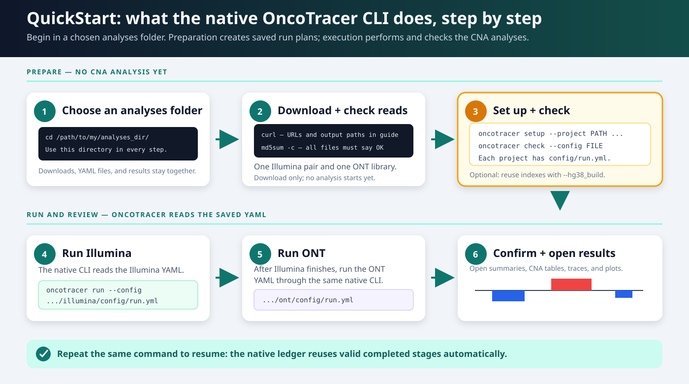
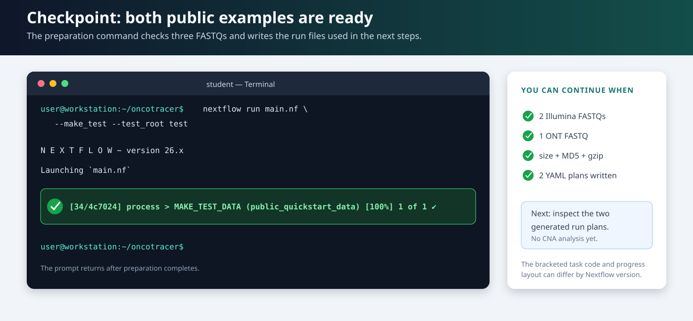
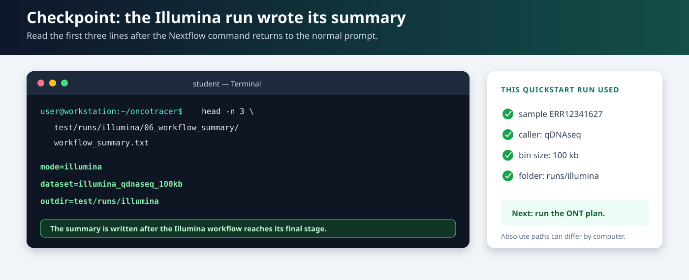
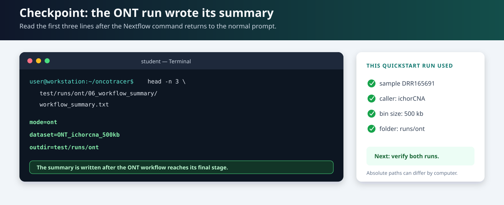
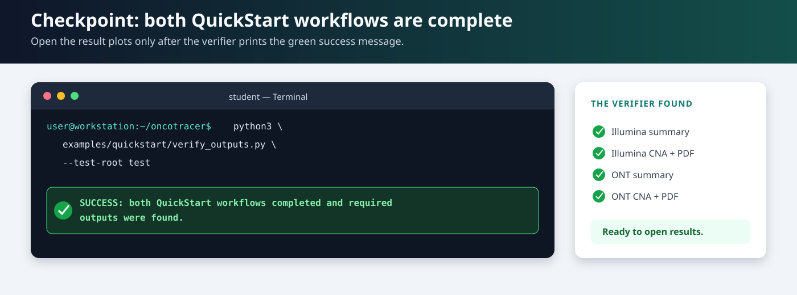

<a id="quick-start"></a>

# QuickStart Example 1: one Illumina and one ONT sample

This tutorial downloads about **225 MB** of public reads, generates one Illumina YAML and one ONT YAML, runs both workflows, and checks the required outputs.

Use `--docker` on a Linux workstation or server. The Docker option uses [`carlosfarkas/oncotracer:latest`](https://hub.docker.com/r/carlosfarkas/oncotracer). On a configured HPC system, replace `--docker` with `--singularity` in the two analysis commands.



## Estimated time for this analysis

The example reads are small, but an uncached first analysis also downloads the hg38 reference and builds its BWA index. Indexing commonly takes **30–60 minutes** and the pinned task requests 72 GB, so use at least **80 GiB RAM**. The complete Illumina and ONT runs can take longer depending on CPU, disk, network, and container cache state.

## 1. Clone the repository

The tutorial uses `/home/student/oncotracer` as an example path.

```bash
# Clone OncoTracer into the example directory.
git clone https://github.com/cfarkas/oncotracer.git /home/student/oncotracer

# Enter the repository.
cd /home/student/oncotracer

# Confirm the absolute path.
pwd
```

Skip the clone command when the repository already exists.

## 2. Prepare the public reads and YAML files

```bash
# Download and validate the public Illumina and ONT reads, then create both YAML files.
nextflow run /home/student/oncotracer/main.nf --make_test \
  --test_root /home/student/oncotracer/test
```

This command creates the following files and stops before analysis:

```text
/home/student/oncotracer/test/
├── configs/
│   ├── illumina.quickstart.yml
│   └── ont.quickstart.yml
├── public/
│   ├── illumina_ERR12341627/
│   └── ont_DRR165691/
└── runs/
```

```bash
# List the two generated run configurations.
ls -1 /home/student/oncotracer/test/configs
```



## 3. Inspect the generated configurations

```bash
# Show the Illumina run configuration.
sed -n '1,120p' /home/student/oncotracer/test/configs/illumina.quickstart.yml

# Show the ONT run configuration.
sed -n '1,120p' /home/student/oncotracer/test/configs/ont.quickstart.yml
```

The Illumina YAML maps paired FASTQs to public sample `ERR12341627` and uses qDNAseq with 100 kb bins. The ONT YAML maps `barcode01` to public sample `DRR165691` and uses ichorCNA with 500 kb bins.

## 4. Run the Illumina example

```bash
# Run the Illumina configuration with Docker and a persistent work directory.
nextflow run /home/student/oncotracer/main.nf --docker \
  -params-file /home/student/oncotracer/test/configs/illumina.quickstart.yml \
  -work-dir /home/student/oncotracer/test/work/illumina \
  -resume
```

The outer `RUN_ILLUMINA_SAMURAI` process can remain at `0 of 1` while the nested SAMURAI workflow is active. Wait for the terminal prompt to return before starting the ONT example.

```bash
# Read the Illumina workflow summary.
head -n 6 \
  /home/student/oncotracer/test/runs/illumina/06_workflow_summary/workflow_summary.txt
```



## 5. Run the ONT example

```bash
# Run the ONT configuration with Docker and a persistent work directory.
nextflow run /home/student/oncotracer/main.nf --docker \
  -params-file /home/student/oncotracer/test/configs/ont.quickstart.yml \
  -work-dir /home/student/oncotracer/test/work/ont \
  -resume
```

```bash
# Read the ONT workflow summary.
head -n 6 \
  /home/student/oncotracer/test/runs/ont/06_workflow_summary/workflow_summary.txt
```



## 6. Verify both results

```bash
# Check the workflow summaries, CNA tables, and per-sample plot PDFs.
python3 /home/student/oncotracer/examples/quickstart/verify_outputs.py \
  --test-root /home/student/oncotracer/test
```

A successful check prints:

```text
SUCCESS: both QuickStart workflows completed and required outputs were found.
```



Important output directories are:

```text
/home/student/oncotracer/test/runs/illumina/
├── 01_samurai_illumina/
├── 03_cna_codification/
├── 04_cna_custom_plots/
└── 06_workflow_summary/

/home/student/oncotracer/test/runs/ont/
├── 01_samurai_ont/
├── 03_cna_codification/
├── 04_cna_custom_plots/
└── 06_workflow_summary/
```

## Exact commands to repeat or resume

```bash
# Enter the cloned repository.
cd /home/student/oncotracer

# Prepare or refresh the validated public test data and YAML files.
nextflow run /home/student/oncotracer/main.nf --make_test \
  --test_root /home/student/oncotracer/test

# Run or resume the Illumina example.
nextflow run /home/student/oncotracer/main.nf --docker \
  -params-file /home/student/oncotracer/test/configs/illumina.quickstart.yml \
  -work-dir /home/student/oncotracer/test/work/illumina \
  -resume

# Run or resume the ONT example after Illumina finishes.
nextflow run /home/student/oncotracer/main.nf --docker \
  -params-file /home/student/oncotracer/test/configs/ont.quickstart.yml \
  -work-dir /home/student/oncotracer/test/work/ont \
  -resume

# Verify both completed result directories.
python3 /home/student/oncotracer/examples/quickstart/verify_outputs.py \
  --test-root /home/student/oncotracer/test
```

## Next steps

- [Automatic Setup](auto_params.md): generate a YAML for your own Illumina or ONT FASTQs.
- [QuickStart Example 2](public_cohort.md): download and run three paired public HCC1143 libraries.
- [Full Tutorial](full_tutorial.md): process all 12 public PRJNA754199 libraries.
- [Other Example Run](six_tumor_four_control.md): configure six tumors and four controls. The FASTQs for that page are **not included** and must be supplied by the user.

OncoTracer is for research use and is not a standalone diagnostic system.
