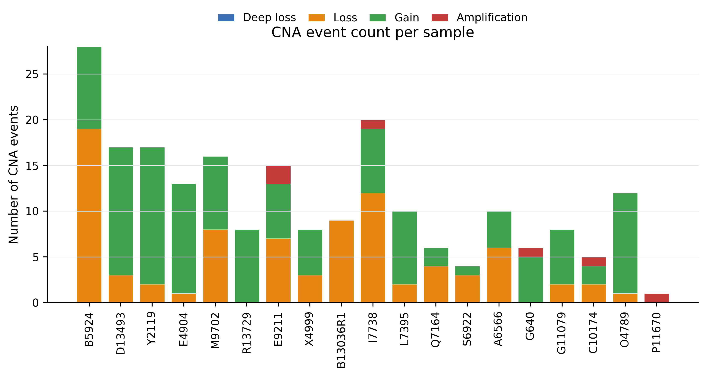
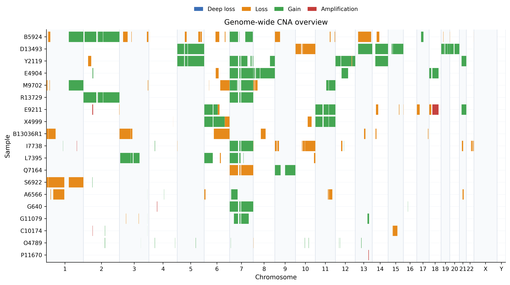
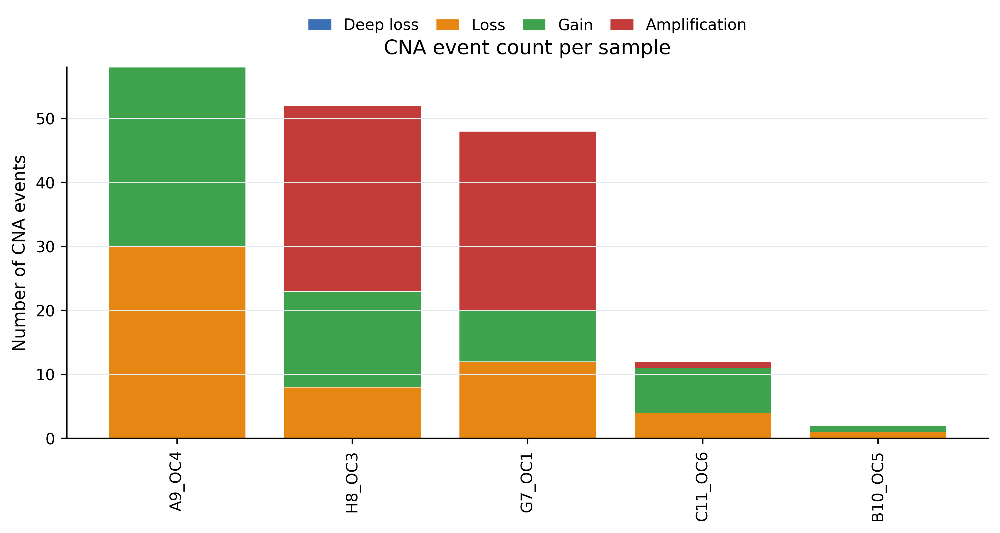

# Tutorial

This tutorial follows the same three FASTQ-first entry points used in the README.

## 1. Illumina FASTQ

```bash
cp params/illumina.example.yml params/my_illumina.yml
nano params/my_illumina.yml
nextflow run main.nf --docker -params-file params/my_illumina.yml -resume
```

Edit these YAML fields first:

```yaml
outdir: /path/to/OncoTracer_illumina
illumina_samplesheet: /path/to/illumina.samplesheet.csv
illumina_samurai_outdir: /path/to/OncoTracer_illumina/01_samurai_illumina
```

## 2. ONT fastq_pass / Barcodes

```bash
cp params/ont.example.yml params/my_ont.yml
nano params/my_ont.yml
nextflow run main.nf --docker -params-file params/my_ont.yml -resume
```

Edit these YAML fields first:

```yaml
outdir: /path/to/OncoTracer_ONT
ont_folder: /path/to/fastq_pass
ont_barcodes: barcode01,barcode02
ont_sample_names: sample1,sample2
ont_samurai_outdir: /path/to/OncoTracer_ONT/01_samurai_ont
```

## 3. Illumina FASTQ + Pathology

```bash
cp params/illumina.pathology.example.yml params/my_illumina_pathology.yml
nano params/my_illumina_pathology.yml
nextflow run main.nf --docker -params-file params/my_illumina_pathology.yml -resume
```

Edit the pathology fields:

```yaml
run_cna_classifier: true
pathology_csv: /path/to/pathology.csv
pathology_sample_col: illumina_sample_id
pathology_case_col: case_code
pathology_diagnosis_col: final_diagnosis
```

## Example Output Images

These images were generated from previous OncoTracer tutorial runs and show the expected style of CNA summaries.








